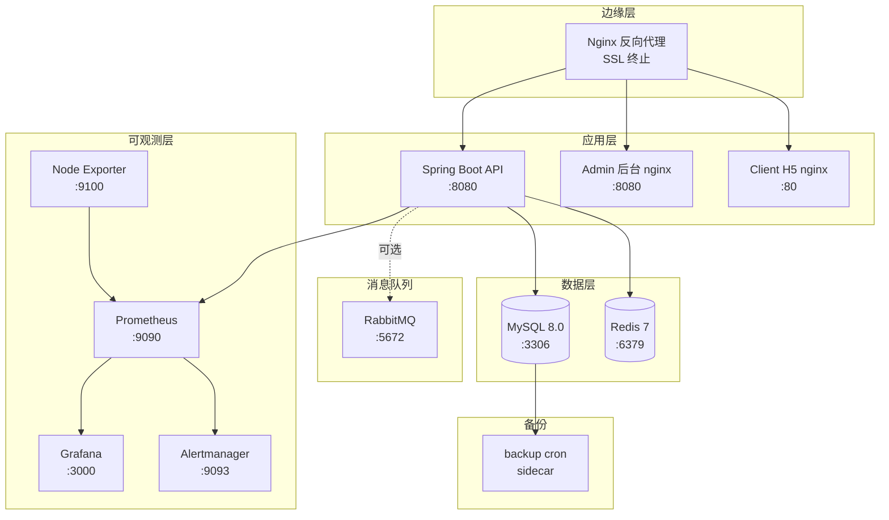

# 部署指南

## 前置要求

### 操作系统

- **生产**：Linux（推荐 Ubuntu 22.04 LTS / Debian 12 / CentOS Stream 9），内核 5.15+
- **开发/测试**：Windows 10/11、macOS 13+、Linux 均可
- **架构**：x86_64（amd64）；arm64 需自行验证镜像兼容性

### 软件依赖

- Node.js `>=18.0.0 <20.0.0`（前端构建，见根目录 `engines` 字段）
- Java 17+（后端运行）
- MySQL 8.0+（real profile 必需）
- Redis 7+（real profile 必需）
- Maven 3.9+（后端构建，已内置 `mvnw` wrapper）
- pnpm 11.x（前端构建，统一包管理器，见 `packageManager` 字段）
- Docker 24+ & Docker Compose 2.20+（容器化部署）

### 资源要求（生产单节点最小配置）

| 服务规模 | CPU | 内存 | 磁盘 | 备注 |
|----------|-----|------|------|------|
| 小型（< 1k DAU） | 2 核 | 4 GB | 40 GB SSD | API + MySQL + Redis + 监控同机部署 |
| 中型（1k–10k DAU） | 4 核 | 8 GB | 100 GB SSD | 推荐 MySQL/Redis 独立节点 |
| 大型（> 10k DAU） | 8+ 核 | 16+ GB | 200+ GB SSD | 必须拆分节点，启用读写分离与对象存储 |

> 磁盘需预留至少 3 倍 MySQL 数据卷大小（用于备份、Flyway 迁移回滚、日志归档）。
> 监控数据保留：Prometheus 默认 15 天，Grafana 持久化卷 10 GB。

### 网络

- 出网：拉取 Docker 镜像、调用微信 API（`api.weixin.qq.com`）、Agnes AI（`api.agnes-ai.com`）
- 入网：仅开放 80/443（Web）、22（SSH，建议限源 IP）；MySQL/Redis/监控端口不对外
- 微信小程序合法域名：生产环境必须配置 HTTPS 域名，详见「域名与 SSL」小节

## 部署架构图

### 服务依赖（mermaid）



### 启动顺序（depends_on）

```
mysql ─┐
       ├─→ api ─→ admin ─→ client (profile: client-h5)
redis ─┘       ↑
                ├─→ prometheus ─→ grafana
                │                └─→ alertmanager
                └─→ node-exporter (profile: monitoring)
mysql ─→ backup (profile: backup)
```

- `api` 依赖 `mysql` 与 `redis` 均健康（`condition: service_healthy`）
- `admin` 与 `client` 依赖 `api` 健康
- `prometheus` 依赖 `api`（无需等待健康，仅启动顺序）
- `grafana` 与 `alertmanager` 依赖 `prometheus`
- `backup` 依赖 `mysql` 健康

## 环境变量配置

### 前端环境变量

创建 `apps/client/.env` 文件（mock 模式，无需后端）：

```bash
VITE_API_MODE=mock
VITE_APP_VERSION=v0.1.0
```

创建 `apps/client/.env.real` 文件（真实模式，需要后端）：

```bash
VITE_API_MODE=real
VITE_API_BASE_URL=https://api.campuslove.example.com/api
VITE_APP_VERSION=v0.1.0
```

### 后端环境变量

复制 `.env.example` 为 `.env`，按注释提示填写真实值：

```bash
cp .env.example .env
# 编辑 .env 文件，至少配置以下必填项（infra #39 补全）：
# - MYSQL_ROOT_PASSWORD / MYSQL_PASSWORD（数据库密码，compose 强制注入）
# - REDIS_PASSWORD（Redis 密码，compose 强制注入）
# - JWT_SECRET（≥ 32 字符，建议 openssl rand -base64 48 生成）
# - GRAFANA_ADMIN_PASSWORD（Grafana 管理员密码，compose 强制注入）
# - DB_URL / DB_USERNAME / DB_PASSWORD（非容器化部署时使用）
# - ADMIN_OPENID（管理员 OpenID，生产部署必填）
# - ADMIN_INITIAL_PASSWORD_HASH（管理员初始密码 BCrypt 哈希，首次部署必填）
# - WECHAT_APPID / WECHAT_SECRET（小程序部署必填）
```

所有环境变量的语义与默认值参见 `.env.example` 注释。

## 本地开发

### 启动后端（Mock 模式）

```bash
# Windows
cd apps/api
.\mvnw.cmd spring-boot:run -Dspring.profiles.active=mock

# macOS/Linux
cd apps/api
./mvnw spring-boot:run -Dspring.profiles.active=mock
```

后端将在 http://localhost:8080 启动。

### 启动后端（Real 模式）

确保 MySQL / Redis 已启动（可使用 `docker compose up -d mysql redis`），然后：

```bash
cd apps/api
.\mvnw.cmd spring-boot:run -Dspring.profiles.active=real
```

### 启动前端（H5 模式）

```bash
# Mock 模式
pnpm client:dev:h5

# Real 模式
pnpm client:dev:h5:real
```

前端将在 http://localhost:5173 启动。

### 启动 Admin 后台

```bash
cd apps/admin
pnpm install
pnpm dev
```

Admin 后台将在 http://localhost:5180 启动。

## 微信小程序构建

```bash
# Windows
build-mp-weixin.bat

# 或手动构建
pnpm --filter @campus-love/client run build:mp-weixin
```

构建产物在 `apps/client/dist/build/mp-weixin` 目录。
打开微信开发者工具，导入上述目录即可预览。

## 生产部署

### 后端部署

#### 1. 构建 JAR 包

```bash
cd apps/api
.\mvnw.cmd clean package -DskipTests
```

构建产物：`apps/api/target/campus-love-api-0.1.0.jar`

#### 2. 运行（直接 JVM 启动）

**JVM 参数必须在 `-jar` 之前**，否则会被当作应用参数而忽略：

```bash
# 正确写法：JVM 参数（-Xms/-Xmx/-D...）在 -jar 之前
java -Xms512m -Xmx2g \
     -XX:+UseG1GC \
     -XX:MaxGCPauseMillis=200 \
     -XX:+HeapDumpOnOutOfMemoryError \
     -XX:HeapDumpPath=/var/log/campus-love-api/heap-dump.hprof \
     -Dspring.profiles.active=real \
     -Dserver.port=8080 \
     -jar target/campus-love-api-0.1.0.jar

# 错误写法（JVM 参数放在 -jar 之后会被 Spring 当作命令行参数，不生效）：
# java -jar target/campus-love-api-0.1.0.jar -Xms512m -Xmx2g  # ❌ -Xms/-Xmx 不生效
```

#### 3. 敏感配置注入

敏感配置通过环境变量注入（推荐），不要通过命令行参数传递：

```bash
# 通过环境变量（推荐）
export JWT_SECRET="your-production-secret-32-chars-min"
export DB_URL="jdbc:mysql://db-host:3306/campus_love?useSSL=true"
export DB_USERNAME="campus"
export DB_PASSWORD="your-strong-db-password"
export REDIS_PASSWORD="your-redis-password"
export WECHAT_APPID="wx1234567890abcdef"
export WECHAT_SECRET="your-wechat-app-secret"
java -Xms512m -Xmx2g -Dspring.profiles.active=real -jar campus-love-api-0.1.0.jar

# 或通过 .env 文件（需配合 systemd EnvironmentFile 或 docker-compose env_file）
```

### 前端部署

#### 1. 构建 H5 版本

```bash
pnpm install --frozen-lockfile
pnpm client:build:h5:real
```

构建产物：`apps/client/dist/build/h5`

#### 2. 部署到 Web 服务器

将 `dist/build/h5` 目录部署到 Nginx / Apache / CDN，配置 SPA fallback 到 `index.html`。

参考 `apps/admin/docker/nginx.conf` 配置 API 代理与静态资源托管。

## Docker 部署

### 使用 docker-compose 一键部署

```bash
# 复制环境变量模板并填写真实值
cp .env.example .env
# 编辑 .env，至少修改所有 *PASSWORD* / *SECRET* / *_KEY 字段

# 启动全部服务（API + Admin + MySQL + Redis + 监控）
docker compose up -d

# 查看服务状态
docker compose ps

# 查看日志
docker compose logs -f api

# 停止全部服务
docker compose down
```

### 仅启动基础设施（开发联调）

```bash
# 仅启动 MySQL + Redis，API 与前端在本地运行
docker compose up -d mysql redis
```

### 启动监控告警

```bash
# 启动 Prometheus + Grafana + Alertmanager + Node Exporter
docker compose --profile monitoring up -d

# Grafana 访问地址：http://localhost:3001
# 默认账号：admin / .env 中 GRAFANA_ADMIN_PASSWORD
```

### 启动数据库备份

```bash
# 启动 db-backup 服务（每日凌晨 2 点自动备份，可通过 BACKUP_CRON 修改）
docker compose --profile backup up -d

# 手动触发一次备份（容器内脚本挂载点为 /backup.sh，infra #38 修正）
docker compose exec backup /backup.sh
```

### Docker Compose 服务清单（与 `docker-compose.yml` 对齐）

> 权威源以 `docker-compose.yml` 为准，本表变更须同步更新 compose 文件与 `.env.example`。

| 服务 | 镜像 | 宿主机端口（默认） | 容器端口 | Profile | 健康检查 | 日志驱动 |
|------|------|---------------------|----------|---------|----------|----------|
| `mysql` | `mysql:8.0` | `${MYSQL_PORT:-3306}` | 3306 | 默认 | `mysqladmin ping` (10s/5s/10次/start 30s) | json-file (10m×5) |
| `redis` | `redis:7-alpine` | `${REDIS_PORT:-6379}` | 6379 | 默认 | `redis-cli ping` (10s/5s/5次/start 10s) | json-file (10m×5) |
| `api` | `campus-love/api:${TAG:-dev}` | `${API_PORT:-8080}` | 8080 | 默认 | `curl /actuator/health` (30s/5s/5次/start 90s) | json-file (10m×5) |
| `admin` | `campus-love/admin:${TAG:-dev}` | `${ADMIN_PORT:-5180}` | 8080 | 默认 | `curl /healthz` (30s/5s/3次/start 10s) | json-file (10m×5) |
| `client` | `nginx:1.27-alpine` | `${CLIENT_PORT:-5173}` | 80 | `client-h5` | `wget /` (30s/5s/3次/start 10s) | json-file (10m×5) |
| `prometheus` | `prom/prometheus:v2.55.0` | `${PROMETHEUS_PORT:-9090}` | 9090 | 默认 | `wget /-/healthy` (30s/5s/3次) | json-file (10m×5) |
| `grafana` | `grafana/grafana:11.3.0` | `${GRAFANA_PORT:-3001}` | 3000 | 默认 | `wget /api/health` (30s/5s/3次/start 30s) | json-file (10m×5) |
| `alertmanager` | `prom/alertmanager:v0.27.0` | `${ALERTMANAGER_PORT:-9093}` | 9093 | 默认 | `wget /-/healthy` (30s/5s/3次) | json-file (10m×5) |
| `node-exporter` | `prom/node-exporter:v1.8.2` | `${NODE_EXPORTER_PORT:-9100}` | 9100 | `monitoring` | `wget /-/healthy` (30s/5s/3次/start 10s) | json-file (10m×5) |
| `backup` | `alpine:3.19` | - | - | `backup` | `pgrep crond` (60s/5s/3次/start 30s) | json-file (10m×3) |

> **健康检查说明**：`interval/timeout/retries/start_period` 格式。`mysql` 与 `redis` 的 healthcheck 分别通过容器环境变量 `MYSQL_PWD` / `REDISCLI_AUTH` 传递密码，密码不出现在进程参数中（infra #3）。
>
> **日志驱动说明**：所有服务统一使用 `json-file` 日志驱动，通过 `max-size` 与 `max-file` 限制单文件大小（10MB）与轮转文件数（5 个，backup 为 3 个），避免日志撑满磁盘。
>
> **Profile 说明**：
> - 默认启动：`mysql`、`redis`、`api`、`admin`、`prometheus`、`grafana`、`alertmanager`
> - `--profile client-h5`：追加 `client`（H5 预览，mp-weixin 产物需在微信开发者工具中导入）
> - `--profile monitoring`：追加 `node-exporter`（主机指标采集）
> - `--profile backup`：追加 `backup`（MySQL 定时备份 cron sidecar）

> 启动顺序与依赖关系见本文档开头「部署架构图 → 启动顺序」小节。

### 环境变量清单（与 `.env.example` 对齐）

> 完整字段与默认值见 `.env.example`。以下为 docker-compose.yml 中实际引用的变量：

| 变量名 | 必填 | 默认值 | 用途 | 对应服务 |
|--------|------|--------|------|----------|
| `MYSQL_ROOT_PASSWORD` | ✅ | - | MySQL root 密码（healthcheck 与 backup 服务复用） | mysql、backup |
| `MYSQL_DATABASE` | - | `campus_love` | MySQL 初始化数据库名 | mysql、api、backup |
| `MYSQL_USER` | - | `campus` | MySQL 业务用户名 | mysql、api |
| `MYSQL_PASSWORD` | ✅ | - | MySQL 业务用户密码（api 中作为 DB_PASSWORD） | mysql、api |
| `MYSQL_PORT` | - | `3306` | MySQL 宿主机端口 | mysql |
| `REDIS_PASSWORD` | ✅ | - | Redis 认证密码 | redis、api |
| `REDIS_PORT` | - | `6379` | Redis 宿主机端口 | redis |
| `JWT_SECRET` | ✅ | - | JWT 签名密钥（≥ 48 字符） | api |
| `JWT_EXPIRATION_MS` | - | `86400000` | JWT 有效期（毫秒） | api |
| `WECHAT_APPID` | - | - | 微信小程序 AppID | api |
| `WECHAT_SECRET` | - | - | 微信小程序 AppSecret | api |
| `CORS_ALLOWED_ORIGINS` | - | `https://www.campuslove.example.com,https://admin.campuslove.example.com,localhost:5173/5174/5180` | CORS 白名单 | api |
| `AGNES_API_KEY` | - | - | Agnes AI 服务密钥 | api |
| `AGNES_API_BASE` | - | `https://api.agnes-ai.com/api` | Agnes AI 服务地址 | api |
| `AGNES_TIMEOUT_MS` | - | `30000` | Agnes AI 超时 | api |
| `ADMIN_OPENID` | ✅（生产） | - | 管理员 OpenID（默认空，生产必填） | api |
| `ADMIN_NICKNAME` | - | `系统管理员` | 管理员昵称 | api |
| `ADMIN_INITIAL_PASSWORD_HASH` | - | - | 管理员初始密码 BCrypt 哈希 | api |
| `RABBITMQ_HOST` / `RABBITMQ_PORT` / `RABBITMQ_USERNAME` / `RABBITMQ_PASSWORD` | - | 默认 guest | RabbitMQ 连接（可选） | api |
| `API_PORT` | - | `8080` | API 宿主机端口 | api |
| `ADMIN_PORT` | - | `5180` | Admin 宿主机端口 | admin |
| `CLIENT_PORT` | - | `5173` | Client H5 宿主机端口 | client |
| `GRAFANA_ADMIN_USER` | - | `admin` | Grafana 管理员账号 | grafana |
| `GRAFANA_ADMIN_PASSWORD` | ✅ | - | Grafana 管理员密码 | grafana |
| `GRAFANA_PORT` | - | `3001` | Grafana 宿主机端口 | grafana |
| `PROMETHEUS_PORT` | - | `9090` | Prometheus 宿主机端口 | prometheus |
| `ALERTMANAGER_PORT` | - | `9093` | Alertmanager 宿主机端口 | alertmanager |
| `NODE_EXPORTER_PORT` | - | `9100` | Node Exporter 宿主机端口 | node-exporter |
| `BACKUP_RETENTION_DAYS` | - | `7` | 备份保留天数 | backup |
| `BACKUP_CRON` | - | `0 2 * * *` | 备份 cron 表达式（由 backup 服务启动命令写入 crontab） | backup |
| `BACKUP_DIR` | - | `/backups` | 备份存储目录（容器内，与宿主 `./backups` bind 挂载对齐） | backup |
| `TAG` | - | `dev` | Docker 镜像 tag（生产必须注入 git sha / release tag，禁止 latest） | api、admin |

> **安全提示**（P1.19）：docker-compose.yml 中所有密码字段使用 `${VAR:?error message}` 形式，未设置环境变量时 `docker compose up` 会失败（强制注入，无弱默认值兜底）。必填字段：`MYSQL_ROOT_PASSWORD` / `MYSQL_PASSWORD` / `REDIS_PASSWORD` / `JWT_SECRET` / `GRAFANA_ADMIN_PASSWORD`。

> 数据库初始化详见下方「数据库初始化」小节；备份恢复详见「启动数据库备份」小节与 `docs/CI-CD.md` 第八章「数据备份与恢复」、`docs/DR/restore-procedure.md`。

### 镜像签名验证（P3-D.2）

CI 流水线在 `security-scan` job 中使用 [cosign](https://github.com/sigstore/cosign)
对构建产物 `campus-love-api` / `campus-love-admin` 镜像进行签名。部署端可在拉取镜像后
验证签名，确保镜像未被篡改。

**部署端验证签名：**

```bash
# 1. 安装 cosign（见 https://github.com/sigstore/cosign/releases）
#    或使用容器：docker run --rm gcr.io/projectsigstore/cosign:latest verify ...

# 2. 导入公钥（与 CI 中 COSIGN_PRIVATE_KEY 对应的公钥）
#    将 cosign.pub 放到部署机（不入库）
export COSIGN_PUB_PATH=/etc/campus-love/cosign.pub

# 3. 验证镜像签名
cosign verify --key $COSIGN_PUB_PATH campus-love-api:ci-<commit-sha>
cosign verify --key $COSIGN_PUB_PATH campus-love-admin:ci-<commit-sha>
# 验证通过返回 0，并在输出中显示签名者与证书信息；失败返回非 0
```

**在 docker-compose 中强制验证（部署脚本示例）：**

```bash
# 拉取镜像后先验证签名，通过再 docker compose up
TAG=ci-abc1234
cosign verify --key /etc/campus-love/cosign.pub campus-love-api:$TAG || exit 1
cosign verify --key /etc/campus-love/cosign.pub campus-love-admin:$TAG || exit 1
TAG=$TAG docker compose up -d api admin
```

**密钥配置说明：**

- 仓库管理员需在 GitHub repo Settings → Secrets and variables → Actions 中添加：
  - `COSIGN_PRIVATE_KEY`：cosign 私钥（`cosign generate-key-pair` 生成的 `cosign.key` 内容）
  - `COSIGN_PASSWORD`：私钥口令
- 对应公钥 `cosign.pub` 分发给部署方，用于部署端验证
- 未配置 secrets 时，CI 中签名步骤自动跳过（PR 场景不影响构建）

## 数据库初始化

Flyway 迁移在应用启动时自动执行（`spring.flyway.enabled=true`），无需手动运行。

如需手动验证迁移状态：

```bash
cd database/flyway
.\flyway migrate -configFiles=flyway.toml \
  -Url="jdbc:mysql://127.0.0.1:3306/campus_love" \
  -User=campus -Password=your-password
```

## 配置文件分离（Task 8.4.5）

后端配置文件按以下原则分离：

| 文件 | 用途 | 是否包含敏感信息 |
|------|------|------------------|
| `application.yml` | 主配置，包含非敏感默认值与环境变量占位 | 否 |
| `application-mock.yml` | Mock profile 配置（开发环境） | 否 |
| `application-real.yml` | Real profile 配置（数据库/Redis/Flyway） | 否（仅占位符） |
| `application-secret.yml` | 敏感配置（密钥/密码），**不入库** | 是 |

**敏感配置注入方式（按优先级）：**

1. **环境变量**（推荐）：通过 `JWT_SECRET` / `DB_PASSWORD` 等环境变量注入
2. **密钥管理服务**（生产）：通过 Vault / AWS Secrets Manager / Kubernetes Secrets 注入
3. **`.env` 文件**（本地开发）：项目根目录的 `.env` 文件，已加入 `.gitignore`

**禁止做法：**

- ❌ 将真实密钥硬编码到 `application.yml` / `application-real.yml`
- ❌ 将含密钥的 `.env` 文件提交到版本控制系统
- ❌ 在 Dockerfile 中通过 `ENV` 指令硬编码密钥

## 验证部署

### 1. 健康检查

```bash
curl http://localhost:8080/actuator/health
# 期望返回：{"status":"UP"}
```

### 2. 接口验证

```bash
# 无需认证的接口
curl http://localhost:8080/api/v1/auth/health

# 需要认证的接口（先获取 JWT）
TOKEN=$(curl -X POST http://localhost:8080/api/v1/auth/admin/login \
  -H "Content-Type: application/json" \
  -d '{"username":"admin","password":"your-password"}' | jq -r '.data.token')
curl -H "Authorization: Bearer $TOKEN" http://localhost:8080/api/v1/profile/me
```

### 3. Swagger UI（仅 ADMIN 可访问）

访问 http://localhost:8080/swagger-ui.html，使用管理员账号获取 JWT 后点击 "Authorize" 按钮填入。

### 4. 监控面板

- Prometheus：http://localhost:9090
- Grafana：http://localhost:3001
- Alertmanager：http://localhost:9093

## 备份与恢复（P3-D.3）

### 备份策略

`backup` 服务（`docker-compose.yml` 中 `profiles: [backup]`）基于 alpine + cron 实现，
每天 02:00（容器内 `TZ=Asia/Shanghai`）自动执行 `scripts/backup-mysql.sh`，产出：

- MySQL 全量备份：`./backups/<db>-<YYYYMMDD-HHMMSS>.sql.gz`（gzip 压缩，`--single-transaction` 一致性快照）
- Redis RDB 备份：`./backups/redis-<YYYYMMDD-HHMMSS>.rdb`（BGSAVE 后复制 `dump.rdb`）

**保留策略**：默认保留 7 天（`BACKUP_RETENTION_DAYS` 可调），过期 `.sql.gz` / `.rdb` 文件自动删除。

**手动触发备份**：

```bash
# 立即执行一次备份（不等待 cron 调度）
docker compose --profile backup run --rm backup /backup.sh

# dry-run 模式（仅打印不实际执行）
docker compose --profile backup run --rm backup /backup.sh --dry-run
```

**查看备份日志**：

```bash
# cron 日志（backup 容器内 /backup/cron.log）
docker compose logs backup
# 或进入容器查看
docker compose exec backup cat /backup/cron.log 2>/dev/null || true
```

### MySQL 恢复

```bash
# 1. 停止 API 服务避免恢复期间有写入
docker compose stop api

# 2. 解压备份文件并恢复到 MySQL
gunzip -c ./backups/campus_love-20260729-020000.sql.gz | \
  docker compose exec -T mysql mysql -uroot -p"$MYSQL_ROOT_PASSWORD" campus_love

# 3. 验证关键表行数
docker compose exec mysql mysql -uroot -p"$MYSQL_ROOT_PASSWORD" campus_love \
  -e "SELECT COUNT(*) FROM users; SELECT COUNT(*) FROM posts;"

# 4. 重启 API
docker compose up -d api
```

**部分恢复（仅单表）**：从解压后的 SQL 文件中提取 `INSERT INTO <table>` 语句执行。

### Redis 恢复

⚠️ Redis RDB 恢复会覆盖现有数据，请在确认无关键 session 后操作。

```bash
# 1. 停止 redis 服务
docker compose stop redis

# 2. 将备份的 dump.rdb 复制到 redis-data 卷（覆盖现有 RDB）
docker run --rm -v campus-redis-data:/data -v "$(pwd)/backups:/backups" alpine \
  sh -c "cp /backups/redis-20260729-020000.rdb /data/dump.rdb && chmod 644 /data/dump.rdb"

# 3. 重启 redis（启动时自动加载 dump.rdb）
docker compose up -d redis

# 4. 验证数据
docker compose exec redis redis-cli -a "$REDIS_PASSWORD" DBSIZE
```

**注意**：
- Redis AOF（`appendonly yes`）开启时，重启会优先从 AOF 恢复。如需强制使用 RDB 恢复，
  需先删除 `appendonly.aof` 文件，或临时关闭 AOF。
- 恢复后建议 `redis-cli BGREWRITEAOF` 重写 AOF 与 RDB 对齐。

### 备份保留策略

| 配置项 | 默认值 | 说明 |
|--------|--------|------|
| `BACKUP_RETENTION_DAYS` | `7` | 过期清理阈值（天） |
| `BACKUP_CRON` | `0 2 * * *` | cron 表达式（每天 02:00，由启动命令写入 crontab） |
| `BACKUP_DIR` | `/backups`（compose 注入，容器内） | 备份存储目录，对应宿主 `./backups`（infra #16：与 backup-mysql.sh 的 BACKUP_DIR 环境变量对齐；脚本自身默认值为 `/backup`，compose 部署时以 `/backups` 覆盖） |

**异地备份建议**：将 `./backups` 目录定期同步到对象存储（OSS/S3）或异地服务器，
避免单机故障导致备份丢失。可使用 `rclone` 或 `aws s3 sync`：

```bash
# 示例：每日同步到 S3
rclone sync ./backups remote:campus-love-backups/ --transfers 4
```

更完整的灾难恢复流程见 `docs/DR/restore-procedure.md` 与 `docs/DR/DRP.md`。

## 域名与 SSL

### 域名规划

生产环境建议至少配置以下域名（均可通过 Nginx 反向代理复用同一台主机）：

| 域名 | 用途 | 后端服务 | 备注 |
|------|------|----------|------|
| `api.campuslove.example.com` | 后端 API | `api:8080` | 微信小程序合法域名必须 HTTPS |
| `admin.campuslove.example.com` | Admin 后台 | `admin:8080` | 内部运营使用，可限源 IP |
| `www.campuslove.example.com`（或根域） | H5 客户端 | `client:80` | 可选，仅 H5 部署时需要 |
| `grafana.campuslove.example.com` | Grafana 监控面板 | `grafana:3000` | 强烈建议内网或限源访问 |

> 微信小程序「服务器域名」配置：登录 mp.weixin.qq.com → 开发管理 → 开发设置 → 服务器域名，将 `https://api.campuslove.example.com` 添加到 request 合法域名。

### SSL 证书申请

#### 方式一：Let's Encrypt（免费，推荐）

```bash
# 1. 安装 certbot（Ubuntu/Debian）
sudo apt install -y certbot python3-certbot-nginx

# 2. 申请证书（需先配置好 Nginx 80 端口解析到本机）
sudo certbot --nginx -d api.campuslove.example.com -d admin.campuslove.example.com -d www.campuslove.example.com

# 3. 自动续期（certbot 默认安装 systemd timer）
sudo systemctl status certbot.timer
sudo certbot renew --dry-run
```

证书文件路径：`/etc/letsencrypt/live/<domain>/fullchain.pem`、`privkey.pem`。

#### 方式二：商业证书 / 自签证书

```bash
# 商业证书：将 CA 颁发的 fullchain.pem 与 privkey.pem 放到 /etc/nginx/ssl/
# 自签证书（仅开发/测试）：
openssl req -x509 -nodes -days 365 -newkey rsa:2048 \
  -keyout /etc/nginx/ssl/selfsigned.key \
  -out /etc/nginx/ssl/selfsigned.crt \
  -subj "/C=CN/ST=Beijing/L=Beijing/O=Campus Love/CN=api.campuslove.example.com"
```

### Nginx SSL 终止配置

外层 Nginx 反向代理负责 SSL 终止，后端服务保持 HTTP：

```nginx
# /etc/nginx/conf.d/campus-love.conf
server {
    listen 80;
    server_name api.campuslove.example.com admin.campuslove.example.com;
    # HTTP 强制跳转 HTTPS
    return 301 https://$host$request_uri;
}

server {
    listen 443 ssl http2;
    server_name api.campuslove.example.com;

    ssl_certificate     /etc/letsencrypt/live/api.campuslove.example.com/fullchain.pem;
    ssl_certificate_key /etc/letsencrypt/live/api.campuslove.example.com/privkey.pem;
    ssl_protocols       TLSv1.2 TLSv1.3;
    ssl_ciphers         HIGH:!aNULL:!MD5;
    ssl_session_cache   shared:SSL:10m;
    ssl_session_timeout 10m;

    # HSTS
    add_header Strict-Transport-Security "max-age=31536000; includeSubDomains" always;

    client_max_body_size 50m;

    location /api/ {
        proxy_pass http://127.0.0.1:8080/api/;
        proxy_http_version 1.1;
        proxy_set_header Host $host;
        proxy_set_header X-Real-IP $remote_addr;
        proxy_set_header X-Forwarded-For $proxy_add_x_forwarded_for;
        proxy_set_header X-Forwarded-Proto $scheme;
        proxy_set_header Upgrade $http_upgrade;
        proxy_set_header Connection "upgrade";
        proxy_read_timeout 60s;
    }
}

server {
    listen 443 ssl http2;
    server_name admin.campuslove.example.com;

    ssl_certificate     /etc/letsencrypt/live/admin.campuslove.example.com/fullchain.pem;
    ssl_certificate_key /etc/letsencrypt/live/admin.campuslove.example.com/privkey.pem;
    ssl_protocols       TLSv1.2 TLSv1.3;

    # Admin 限源 IP（可选）
    # allow 203.0.113.0/24;
    # deny  all;

    location / {
        proxy_pass http://127.0.0.1:5180/;
        proxy_set_header Host $host;
        proxy_set_header X-Real-IP $remote_addr;
        proxy_set_header X-Forwarded-For $proxy_add_x_forwarded_for;
    }
}
```

> 容器内的 `apps/admin/docker/nginx.conf` 与 `docker/client-nginx.conf` 已配置 SPA fallback、gzip、安全响应头、`/api/` 反代；外层 Nginx 仅负责 SSL 终止与域名路由，将流量转发到对应宿主机端口（8080/5180/5173）。

## Nginx 配置

### 容器内 Nginx（已内置）

| 服务 | 配置文件 | 监听端口 | 职责 |
|------|----------|----------|------|
| `admin` | `apps/admin/docker/nginx.conf` | 8080 | SPA fallback、gzip、`/api/` 与 `/actuator/` 反代到 `API_UPSTREAM` |
| `client` | `docker/client-nginx.conf` | 80 | H5 静态托管、`/api/` 反代、SPA fallback |

两者均通过环境变量 `API_UPSTREAM` 注入后端地址（默认 `host.docker.internal:8080` / `api:8080`）。

### 外层 Nginx（生产推荐）

生产环境建议在宿主机或独立反向代理节点部署外层 Nginx，统一负责：

1. **SSL 终止**：见「域名与 SSL」小节
2. **域名路由**：根据 `Host` 头转发到不同后端服务
3. **负载均衡**：多实例 API 时使用 `upstream` 块

```nginx
upstream campus_api {
    server 127.0.0.1:8080 max_fails=3 fail_timeout=30s;
    # 多实例扩展：
    # server 127.0.0.1:8081 max_fails=3 fail_timeout=30s;
    keepalive 32;
}

server {
    listen 443 ssl http2;
    server_name api.campuslove.example.com;

    # ... SSL 配置同上 ...

    location /api/ {
        proxy_pass http://campus_api/api/;
        proxy_http_version 1.1;
        proxy_set_header Connection "";
        proxy_set_header Host $host;
        proxy_set_header X-Real-IP $remote_addr;
        proxy_set_header X-Forwarded-For $proxy_add_x_forwarded_for;
        proxy_set_header X-Forwarded-Proto $scheme;
        proxy_read_timeout 60s;
        proxy_connect_timeout 30s;
    }
}
```

### Nginx 健康检查

外层 Nginx 自身可用性可通过 `docs/TROUBLESHOOTING.md` 中的 `nginx -t` 与 `systemctl status nginx` 验证；后端服务健康检查由 Docker Compose healthcheck 与 Prometheus blackbox 探针负责。

## 监控与告警

### 监控栈组件

| 组件 | 镜像 | 端口 | 配置文件 | 职责 |
|------|------|------|----------|------|
| Prometheus | `prom/prometheus:v2.55.0` | 9090 | `docker/prometheus/prometheus.yml` | 指标采集与告警评估 |
| Grafana | `grafana/grafana:11.3.0` | 3000 | `docker/grafana/provisioning/` | 可视化面板 |
| Alertmanager | `prom/alertmanager:v0.27.0` | 9093 | `docker/alertmanager/alertmanager.yml` | 告警路由与通知 |
| Node Exporter | `prom/node-exporter:v1.8.2` | 9100 | - | 主机指标采集 |

### 抓取目标

Prometheus 默认抓取以下目标（详见 `docker/prometheus/prometheus.yml`）：

- `campuslove-api`：`http://api:8080/actuator/prometheus`（Spring Boot Actuator）
- `node-exporter`：`http://node-exporter:9100/metrics`（主机 CPU/内存/磁盘）
- `mysql-exporter`（可选）：`http://mysql-exporter:9104/metrics`
- `redis-exporter`（可选）：`http://redis-exporter:9121/metrics`
- `blackbox-http`：外部依赖（微信 API、Agnes AI）与内部服务（Admin 后台）可用性探针
- `prometheus`：自身指标

### 告警规则

告警规则定义在 `docker/prometheus/rules/alert-rules.yml`，主要类别：

- **服务可用性**：`ApiDown` / `MysqlDown` / `RedisDown` / `AdminDown`
- **主机资源**：`HostDiskHigh`（>85%）、`HostMemoryHigh`（>90%）、`HostCpuHigh`（>80%）
- **JVM**：`JvmMemoryHigh`、`JvmGcPauseHigh`
- **业务**：`MatchSuccessRateLow`、`ChatMessageLatencyHigh`、`AuthFailureSpike`

### 告警路由

Alertmanager 按严重级路由（详见 `docker/alertmanager/alertmanager.yml`）：

| 级别 | 接收者 | 等待 | 重复间隔 | 渠道 |
|------|--------|------|----------|------|
| `critical` | `critical-email` | 0s | 1h | 邮件 + 钉钉 |
| `warning` | `warning-webhook` | 30s | 4h | 飞书群机器人 |
| `info` | `null-pager` | - | - | 仅归档，不通知 |

### 通知渠道配置

部署前需在 `.env` 中配置以下变量（可选，未配置则使用默认值占位）：

```bash
# 邮件（critical 级别）
SMTP_HOST=smtp.example.com:587
SMTP_FROM=alert@example.com
SMTP_USER=
SMTP_PASSWORD=
CRITICAL_EMAIL=oncall@example.com

# 钉钉机器人（critical 级别）
DINGTALK_CRITICAL_WEBHOOK=

# 飞书群机器人（warning 级别）
FEISHU_WARNING_WEBHOOK=
```

### Grafana 面板

Grafana 启动后通过 `docker/grafana/provisioning/` 自动加载：

- 数据源：Prometheus（`http://prometheus:9090`）
- 仪表盘：`docker/grafana/dashboards/` 下的 JSON 文件

访问 `http://localhost:3001`，使用 `.env` 中配置的 `GRAFANA_ADMIN_USER` / `GRAFANA_ADMIN_PASSWORD` 登录。

### 验证监控可用

```bash
# 1. Prometheus 抓取目标状态
curl http://localhost:9090/api/v1/targets | jq '.data.activeTargets[] | {job: .labels.job, health: .health}'

# 2. Alertmanager 告警状态
curl http://localhost:9093/api/v2/alerts | jq '.[] | {alertname: .labels.alertname, state: .status.state}'

# 3. Grafana 数据源健康
curl -u admin:$GRAFANA_ADMIN_PASSWORD http://localhost:3001/api/health
```

## 日志收集

### Docker 日志驱动

所有服务统一使用 `json-file` 日志驱动，配置见 `docker-compose.yml`：

```yaml
logging:
  driver: json-file
  options:
    max-size: "10m"    # 单文件最大 10MB
    max-file: "5"      # 保留 5 个轮转文件（backup 为 3）
```

### 查看日志

```bash
# 实时查看某服务日志
docker compose logs -f api

# 查看最近 100 行
docker compose logs --tail 100 api

# 按时间过滤
docker compose logs --since 30m api
```

### 应用日志

后端 Spring Boot 日志配置在 `apps/api/src/main/resources/logback-spring.xml`：

- 默认输出到 `logs/campus-love-api.log`，按天滚动，保留 30 天
- 敏感字段（token / password / openid）自动脱敏
- 容器内路径 `/app/logs`，通过卷 `campus-api-logs` 持久化到宿主 `./logs/api`

### 日志归档与导出

```bash
# 导出最近 7 天 API 日志到本地
docker compose exec api sh -c 'tar -czf - /app/logs/*.log.*' > api-logs-$(date +%Y%m%d).tar.gz

# 或使用 docker logs 导出
docker compose logs --since 7d api > api-logs-$(date +%Y%m%d).log
```

> 生产环境长期保留建议接入集中式日志系统（ELK / Loki + Grafana），通过 `fluentd` 日志驱动或 Filebeat 采集。

## 升级与回滚

### 升级前检查

1. **备份**：触发一次手动备份，确认 `./backups` 下有最新的 `.sql.gz` / `.rdb`
2. **变更日志**：查阅 `CHANGELOG.md` 与 `docs/release-checklist.md`，确认本次升级范围
3. **镜像签名**（如启用 cosign）：验证新镜像签名
   ```bash
   cosign verify --key /etc/campus-love/cosign.pub campus-love-api:$TAG_NEW
   cosign verify --key /etc/campus-love/cosign.pub campus-love-admin:$TAG_NEW
   ```
4. **数据库迁移预演**：在 staging 环境执行 `./mvnw flyway:info` 与 `flyway:migrate`，确认无破坏性 DDL

### 滚动升级（Docker Compose）

Docker Compose 默认按依赖顺序逐个重启服务，可借助 `--no-deps` 避免连带重启：

```bash
# 1. 拉取新镜像
export TAG_NEW=ci-abc1234
docker compose pull api admin

# 2. 仅升级 API（不重启 mysql/redis）
docker compose up -d --no-deps api

# 3. 验证 API 健康（约 90s 后）
curl http://localhost:8080/actuator/health

# 4. 升级 Admin
docker compose up -d --no-deps admin

# 5. 升级 Client H5（如启用 client-h5 profile）
docker compose --profile client-h5 up -d --no-deps client
```

> Flyway 迁移在 API 启动时自动执行；若迁移失败，API 容器会退出，旧实例仍在线服务（已通过 `--no-deps` 隔离）。

### 回滚步骤

#### 镜像回滚（无破坏性 DDL 时）

```bash
# 回滚到上一个稳定 tag
export TAG_ROLLBACK=ci-previous1234
docker compose up -d --no-deps api
docker compose up -d --no-deps admin
```

#### 数据库回滚（Flyway 不支持自动回滚）

Flyway 社区版不支持 undo 迁移，需手动恢复：

```bash
# 1. 停止 API
docker compose stop api

# 2. 从备份恢复 MySQL
gunzip -c ./backups/campus_love-<YYYYMMDD-HHMMSS>.sql.gz | \
  docker compose exec -T mysql mysql -uroot -p"$MYSQL_ROOT_PASSWORD" campus_love

# 3. 回滚到旧镜像
export TAG_ROLLBACK=ci-previous1234
docker compose up -d api
```

> ⚠️ 数据库回滚会丢失自备份点之后的所有数据；建议在低峰期操作，并提前通知用户。

### 蓝绿部署 / 灰度发布

详见 `docs/GRADUAL-RELEASE.md`：

- **蓝绿**：通过两套 docker-compose（`docker-compose.green.yml` / `docker-compose.blue.yml`）+ Nginx upstream 切换
- **灰度**：按用户 ID hash 路由，逐步将流量从旧版本切到新版本（10% → 50% → 100%）

### 升级后验证

```bash
# 1. 健康检查
curl http://localhost:8080/actuator/health | jq

# 2. 关键接口冒烟测试
TOKEN=$(curl -sX POST http://localhost:8080/api/v1/auth/admin/login \
  -H "Content-Type: application/json" \
  -d '{"username":"admin","password":"'$ADMIN_PASSWORD'"}' | jq -r '.data.token')
curl -sH "Authorization: Bearer $TOKEN" http://localhost:8080/api/v1/profile/me | jq

# 3. 监控指标对比
# Prometheus 查询：http_server_requests_seconds_count（升级前后对比）
```

## 故障排查

### 应用启动失败

1. 检查日志：`docker compose logs api` 或 `apps/api/logs/campus-love-api.log`
2. 验证环境变量：`echo $JWT_SECRET` / `echo $DB_PASSWORD`
3. 验证数据库连通性：`mysql -h 127.0.0.1 -u campus -p`
4. 验证 Redis 连通性：`redis-cli -h 127.0.0.1 -a $REDIS_PASSWORD ping`

### 数据库迁移失败

1. 查看 Flyway 状态：`docker compose exec api ./mvnw flyway:info`
2. 修复迁移脚本后重新运行：`docker compose exec api ./mvnw flyway:repair`
3. 参考 `docs/DR/restore-procedure.md` 进行数据恢复

### 更多文档

- 数据库恢复：`docs/DR/restore-procedure.md`
- CI/CD 流程：`docs/CI-CD.md`
- 发布检查清单：`docs/release-checklist-template.md`
