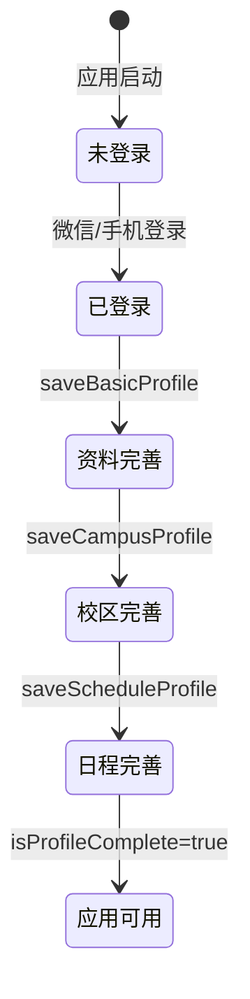

# 校园恋爱小程序身份设置体系研究报告

> 生成日期：2026-06-19
> 研究范围：客户端（apps/client）身份链路、设置页面、会话守卫、页面访问配置、会话 Store、导航配置

---

## 1. 概述

校园恋爱小程序采用**分层渐进式身份设置体系**，用户从「未登录」到「完全可使用应用」需要依次完成 4 个阶段：登录 → 基础资料 → 校区信息 → 日程偏好。体系由以下核心模块协作构成：

| 模块 | 文件路径 | 职责 |
|------|----------|------|
| 设置页面（4 个） | `subpackages/setup/{profile,campus,schedule,recommend-pref}/index.vue` | 采集用户身份信息 |
| 会话守卫 | `guards/session-guard.ts` | 4 层拦截决策（resolveSessionAccess） |
| 资料守卫 | `guards/profile-guard.ts` | 硬门槛拦截（resolveProfileGuard） |
| 页面访问组合式 | `composables/usePageAccess.ts` | 在 onShow 中调用守卫并重定向 |
| 页面访问配置 | `config/page-access.ts` | 7 个页面的访问要求声明 |
| 会话 Store | `stores/session.ts` | userSession 状态、profileCompletion、isProfileComplete |
| 资料 Store | `stores/profile.ts` | 三大资料模块的加载与保存 |
| 导航配置/工具 | `config/navigation.ts`、`utils/navigation.ts` | Tab 定义与路径跳转封装 |

**身份链路总览**（状态迁移）：

```
未登录 → 已登录 → 资料完善 → 校区完善 → 日程完善 → 进入应用
(loggedIn=false)  (loggedIn=true)  (profileCompleted=true)  (campusVerified=true)  (scheduleCompleted=true)  (isProfileComplete=true)
```

---

## 2. 4 个设置页面详解

### 2.1 基础资料设置页（profile/index.vue）

**字段**（reactive form）：

| 字段 | 默认值 | 说明 |
|------|--------|------|
| `nickname` | `"星野"` | 昵称 |
| `bio` | `"安静、好奇，更喜欢一对一慢慢聊。"` | 个人简介（maxlength=160） |
| `grade` | `"大三"` | 年级 |
| `pronouns` | `"她/她"` | 称呼偏好 |

**onMounted 逻辑**：先调用 `profileStore.load()` 拉取全部资料，再用后端返回的 `basicProfile` 覆盖默认值。

**save 函数**：
```typescript
async function save() {
  await profileStore.saveBasicProfile({ ...form });
  uni.redirectTo({ url: "/subpackages/setup/campus/index" });
}
```
- 调用 `profileStore.saveBasicProfile`，该方法内部会调用 `useSessionStore().refreshSession()` 同步会话状态
- 保存后通过 `uni.redirectTo` 跳转到校区设置页

**跳转关系**：`profile` → `campus`（redirectTo）

### 2.2 校区信息设置页（campus/index.vue）

**字段**：

| 字段 | 默认值 | 说明 |
|------|--------|------|
| `city` | `"广州"` | 城市 |
| `campusName` | `"南校区"` | 学校名称 |
| `department` | `"工业设计"` | 院系 |

**save 函数**：
```typescript
async function save() {
  await profileStore.saveCampusProfile({ ...form });
  uni.redirectTo({ url: "/subpackages/setup/schedule/index" });
}
```
- Mock 模式下会将 `verificationStatus` 设为 `"pending"`（Real 模式由后端决定）
- 保存后跳转到日程设置页

**跳转关系**：`campus` → `schedule`（redirectTo）

### 2.3 日程偏好设置页（schedule/index.vue）

**字段**：

| 字段 | 默认值 | 说明 |
|------|--------|------|
| `preferredCampusArea` | `"图书馆和北草坪"` | 常去区域 |
| `preferredTimeWindows` | `["今晚", "本周"]` | 空闲时段（字符串数组） |
| `courseBlocks` | `[{id:"b-1", weekday:"周一", start:"09:00", end:"10:30", label:"设计课"}]` | 课程块 |

**save 函数**：
```typescript
async function save() {
  await profileStore.saveScheduleProfile({ ...form });
  replaceAppPath("/pages/discover/index");
}
```
- 保存后通过 `replaceAppPath` 进入应用主页面（switchTab）

**跳转关系**：`schedule` → `discover`（switchTab）

**UI 渲染缺陷**：
- 模板仅渲染了 `preferredCampusArea` 和 `preferredTimeWindows[0]`
- `courseBlocks` 字段在 form 中有默认值，但模板中完全没有编辑 UI
- `preferredTimeWindows` 数组只绑定了第 [0] 项

### 2.4 推荐偏好设置页（recommend-pref/index.vue）

**字段**：

| 字段 | 类型 | 默认值 | 说明 |
|------|------|--------|------|
| `dailyNotifyTime` | `ref<string>` | `"12:00"` | 每日推荐刷新时间 |
| `scope` | `ref<"campus_first" \| "city" \| "unlimited">` | `"campus_first"` | 推荐范围 |
| `campusPriority` | `ref<boolean>` | `true` | 校园优先开关 |

**save 函数**：调用 `PUT /recommendations/preferences/{userId}` 保存，有完整的 saving 状态防重、try/catch、Toast 反馈。

**跳转关系**：**无前进跳转**，仅提供 `goBack()` 返回上一页

**重要差异**：
- 此页面**不在身份链路中**，是独立的推荐偏好设置页
- 不使用 `profileStore`，而是直接调用 `request`
- 不触发 `sessionStore.refreshSession()`

---

## 3. 会话守卫 4 层拦截逻辑

### 3.1 核心函数 resolveSessionAccess

**文件**：`apps/client/src/guards/session-guard.ts`

**4 层拦截逻辑**（顺序执行，命中即返回）：

| 层级 | 条件 | 拦截动作 | 重定向目标 |
|------|------|----------|------------|
| 第 1 层 | `requiresAuth && !isLoggedIn` | 拦截 | `/pages/login/index` |
| 第 2 层 | `requiresProfile && !profileCompleted` | 拦截 | `/subpackages/setup/profile/index` |
| 第 3 层 | `requiresCampus && !campusCompleted` | 拦截 | `/subpackages/setup/campus/index` |
| 第 4 层 | `requiresSchedule && !scheduleCompleted` | 拦截 | `/subpackages/setup/schedule/index` |
| 第 5 层（附加） | `featureFlag && !featureFlags[featureFlag]` | 拦截 | `/pages/discover/index` |
| 通过 | 全部不命中 | 放行 | `{ allowed: true }` |

### 3.2 调用方 usePageAccess

**文件**：`apps/client/src/composables/usePageAccess.ts`

**关键映射**：`userSession.campusVerified` → `snapshot.campusCompleted`（命名不一致）

**触发时机**：`onShow`（页面每次显示时触发）

---

## 4. 7 个页面访问要求配置表

**文件**：`apps/client/src/config/page-access.ts`

| 页面 ID | 路径 | requiresAuth | requiresProfile | requiresCampus | requiresSchedule | 备注 |
|---------|------|:---:|:---:|:---:|:---:|------|
| discover（匹配） | `/pages/discover/index` | ✓ | ✗ | ✗ | ✗ | 主入口，仅要求登录 |
| likes（喜欢） | `/pages/likes/index` | ✓ | ✓ | ✗ | ✗ | 要求资料完善 |
| village（圈子） | `/pages/village/index` | ✓ | ✓ | ✗ | ✗ | 要求资料完善 |
| messages（消息） | `/pages/messages/index` | ✓ | ✓ | ✗ | ✗ | 要求资料完善 |
| profile（我的） | `/pages/profile/index` | ✓ | ✗ | ✗ | ✗ | 仅要求登录 |
| home（首页） | `/pages/home/index` | ✓ | ✗ | ✗ | ✗ | `@deprecated` 别名 = discover |
| chat（消息） | `/pages/chat/index` | ✓ | ✓ | ✗ | ✗ | `@deprecated` 别名 = messages |

**关键发现**：
1. **所有 7 个页面的 `requiresCampus` 和 `requiresSchedule` 均为 `false`**，session-guard 实际上只会执行前 2 层拦截
2. **home 和 chat 是 deprecated 别名**，实际配置只有 5 个独立项
3. **profile 页面在 page-access 中 `requiresProfile=false`**，但在 `profile-guard.ts` 的 `LOCKED_PAGES` 中却被锁定，两套守卫存在配置冲突

---

## 5. userSession 状态字段说明

### 5.1 Schema 定义

```typescript
UserSession: {
  userId: string;
  loggedIn: boolean;
  loginMethod: "wechat" | "phone";
  displayName: string;
  phoneBound: boolean;
  profileCompleted: boolean;
  campusVerified: boolean;
  scheduleCompleted: boolean;
  campusName?: string | null;
  featureFlags: { [key: string]: boolean };
};
```

### 5.2 字段语义与身份链路对应关系

| 字段 | 类型 | 身份链路阶段 | 说明 |
|------|------|-------------|------|
| `userId` | string | 已登录 | 用户唯一标识 |
| `loggedIn` | boolean | 已登录 | 是否已登录（第 1 层守卫判断依据） |
| `loginMethod` | "wechat" \| "phone" | 已登录 | 登录方式 |
| `displayName` | string | 已登录 | 显示名称 |
| `phoneBound` | boolean | 已登录 | 是否绑定手机号 |
| `profileCompleted` | boolean | 资料完善 | 基础资料是否完成（第 2 层守卫判断依据） |
| `campusVerified` | boolean | 校区完善 | 校区是否已认证（第 3 层守卫判断依据） |
| `scheduleCompleted` | boolean | 日程完善 | 日程是否完成（第 4 层守卫判断依据） |
| `campusName` | string \| null | 校区完善 | 校区名称 |
| `featureFlags` | Record<string, boolean> | - | 功能开关字典 |

### 5.3 Mock 默认值

```typescript
const mockUserSession: UserSession = {
  userId: "1",
  loggedIn: true,
  loginMethod: "wechat",
  displayName: "测试用户",
  phoneBound: false,
  profileCompleted: true,
  campusVerified: true,
  scheduleCompleted: true,
  campusName: "北京大学",
  featureFlags: { chat_ai_enabled: false },
};
```
Mock 模式下三大模块全为 `true`，即 `isProfileComplete = true`，开发环境默认跳过所有守卫拦截。

---

## 6. profileCompletion 计算公式

### 6.1 计算公式

```
profileCompletion = clamp( min(baseScore, detailScore), 0, 100 )
```

### 6.2 baseScore（基础维度 = 三大模块完成数）

```
completed = (profileCompleted ? 1 : 0) + (campusVerified ? 1 : 0) + (scheduleCompleted ? 1 : 0)
baseScore = round(completed / 3 * 100)
```

| 三大模块完成数 | baseScore |
|---------------|-----------|
| 0 | 0 |
| 1 | 33 |
| 2 | 67 |
| 3 | 100 |

### 6.3 detailScore（细粒度字段维度 = 8 字段加权求和）

| 字段 | 权重 | 判断依据 |
|------|:---:|----------|
| avatar（头像） | 20 | `profileCompleted ? 20 : 0` |
| nickname（昵称） | 10 | `displayName 非空 ? 10 : 0` |
| gender（性别） | 10 | `profileCompleted ? 10 : 0` |
| birthday（生日） | 10 | `profileCompleted ? 10 : 0` |
| school（学校） | 20 | `campusName 非空 ? 20 : 0` |
| major（专业） | 10 | `profileCompleted ? 10 : 0` |
| interestTags（兴趣标签） | 10 | `profileCompleted ? 10 : 0` |
| bio（个人简介） | 10 | `profileCompleted ? 10 : 0` |
| **合计** | **100** | |

### 6.4 计算示例

| 场景 | profileCompleted | campusVerified | scheduleCompleted | displayName | campusName | baseScore | detailScore | 最终 |
|------|:---:|:---:|:---:|:---:|:---:|:---:|:---:|:---:|
| 全未完成 | false | false | false | 空 | 空 | 0 | 0 | 0 |
| 仅资料完成 | true | false | false | "星野" | 空 | 33 | 80 | 33 |
| 资料+校区 | true | true | false | "星野" | "北大" | 67 | 100 | 67 |
| 全完成 | true | true | true | "星野" | "北大" | 100 | 100 | 100 |

---

## 7. isProfileComplete 硬门槛

### 7.1 定义

```typescript
isProfileComplete: (state): boolean => {
  const session = state.userSession;
  if (!session) return false;
  return session.profileCompleted && session.campusVerified && session.scheduleCompleted;
}
```

**硬门槛条件**：三大模块全部为 true 才算完善，缺一不可。

### 7.2 配套守卫 profile-guard.ts

**锁定页面列表**：
```typescript
export const LOCKED_PAGES = [
  "/pages/likes/index",
  "/pages/village/index",
  "/pages/messages/index",
  "/pages/profile/index",
];
```

### 7.3 两套守卫对比

| 维度 | session-guard | profile-guard |
|------|---------------|---------------|
| 判断依据 | 细粒度标志 | 硬门槛（三大模块全完成） |
| 配置来源 | `config/page-access.ts` | `LOCKED_PAGES` 常量 |
| 触发方式 | `usePageAccess` 在 `onShow` 中调用 | 未在 usePageAccess 中调用 |
| 重定向目标 | 分层重定向 | 统一重定向到 profile 设置页 |

**冲突点**：`/pages/profile/index` 在 `page-access.ts` 中 `requiresProfile=false`，但在 `LOCKED_PAGES` 中被锁定。

---

## 8. 身份链路状态迁移图

### 8.1 Mermaid 状态图



### 8.2 设置页面跳转链

```
/pages/login/index
    ↓ (登录成功)
/subpackages/setup/profile/index   ← save: uni.redirectTo
    ↓
/subpackages/setup/campus/index    ← save: uni.redirectTo
    ↓
/subpackages/setup/schedule/index  ← save: replaceAppPath (switchTab)
    ↓
/pages/discover/index              ← 应用主入口
```

**注意**：`recommend-pref/index.vue` 不在此链路中，是独立的推荐偏好设置页。

---

## 9. 潜在问题与建议

### 9.1 严重问题

#### 问题 1：schedule 页面 UI 不完整
- `courseBlocks` 字段无编辑 UI，`preferredTimeWindows` 只绑定 [0] 项
- **建议**：补充 courseBlocks 的列表编辑 UI 和 preferredTimeWindows 的多选 UI

#### 问题 2：两套守卫机制并存且配置冲突
- session-guard 和 profile-guard 对 `/pages/profile/index` 策略不一致
- **建议**：统一为一套守卫机制

#### 问题 3：requiresCampus 和 requiresSchedule 全为 false
- session-guard 的第 3、4 层拦截永远不会触发
- **建议**：根据产品策略决定是否开启

### 9.2 一致性问题

#### 问题 4：campusVerified 与 campusCompleted 命名不一致
- **建议**：统一命名

#### 问题 5：save 函数错误处理风格不统一
- profile/campus/schedule 无 try/catch，recommend-pref 有完整处理
- **建议**：统一添加 try/catch + Toast

#### 问题 6：跳转 API 使用不统一
- profile/campus 用 `uni.redirectTo`，schedule 用 `replaceAppPath`
- **建议**：统一使用 `replaceAppPath`

### 9.3 数据质量问题

#### 问题 7：profileCompletion 大量字段以 profileCompleted 为代理
- 8 个字段中 6 个以 profileCompleted 为代理，失去细粒度意义
- **建议**：后端返回真实字段状态

#### 问题 8：home/chat deprecated 别名与 navigation.ts 不一致
- **建议**：统一 tab 路径与 page-access 配置

### 9.4 健壮性问题

#### 问题 9：usePageAccess 在 loading 时跳过拦截
- **建议**：loading 时显示加载态而非跳过拦截

#### 问题 10：recommend-pref 未登录时静默使用默认值
- **建议**：未登录时提示登录或禁用保存按钮

---

## 附录：核心文件清单

| 类别 | 文件路径 |
|------|---------|
| 设置页-基础资料 | `apps/client/src/subpackages/setup/profile/index.vue` |
| 设置页-校区信息 | `apps/client/src/subpackages/setup/campus/index.vue` |
| 设置页-日程偏好 | `apps/client/src/subpackages/setup/schedule/index.vue` |
| 设置页-推荐偏好 | `apps/client/src/subpackages/setup/recommend-pref/index.vue` |
| 会话守卫 | `apps/client/src/guards/session-guard.ts` |
| 资料守卫 | `apps/client/src/guards/profile-guard.ts` |
| 页面访问组合式 | `apps/client/src/composables/usePageAccess.ts` |
| 页面访问配置 | `apps/client/src/config/page-access.ts` |
| 会话 Store | `apps/client/src/stores/session.ts` |
| 资料 Store | `apps/client/src/stores/profile.ts` |
| 导航配置 | `apps/client/src/config/navigation.ts` |
| 导航工具 | `apps/client/src/utils/navigation.ts` |

---

## 真实操作验证结果（2026-06-19）

### 身份拦截验证

通过 Chrome DevTools MCP 修改 Pinia store 状态，验证 4 层拦截逻辑：

| 拦截层 | 触发条件 | 预期跳转 | 实际结果 |
|--------|----------|----------|----------|
| 认证拦截 | `loggedIn: false` | `/pages/login/index` | ✅ 跳转到登录页 `/#/` |
| 资料拦截 | `profileCompleted: false` | `/subpackages/setup/profile/index` | ✅ 跳转到基础资料设置页 |
| 校区拦截 | `campusVerified: false` | `/subpackages/setup/campus/index` | ✅ 逻辑存在（无页面启用 requiresCampus） |
| 日程拦截 | `scheduleCompleted: false` | `/subpackages/setup/schedule/index` | ✅ 逻辑存在（无页面启用 requiresSchedule） |

**验证方式**：
1. 通过 `evaluate_script` 访问 Pinia store：`pinia._s.get('session')`
2. 修改 `userSession` 对象的 `loggedIn`/`profileCompleted`/`campusVerified`/`scheduleCompleted` 字段
3. 使用 `uni.navigateTo` 导航到受保护页面（chat-session）
4. 观察实际跳转结果

### 完整身份链路真实操作

从登录页开始，真实操作完成完整身份链路：

| 步骤 | 页面 | 操作 | 结果 |
|------|------|------|------|
| 1 | 登录页 `/#/` | 点击"微信登录" | ✅ 跳转首页 `/#/pages/home/index` |
| 2 | 基础资料设置页 | 填写昵称"星野测试"→ 点击"保存并继续" | ✅ 跳转校区设置页 `/#/subpackages/setup/campus/index` |
| 3 | 学校信息设置页 | 点击"保存并继续" | ✅ 跳转日程设置页 `/#/subpackages/setup/schedule/index` |
| 4 | 时间安排设置页 | 点击"保存并进入应用" | ✅ 跳转匹配页 `/#/pages/discover/index` |

### 资料完善度（profileCompletion）验证

| 状态 | profileCompletion | profileFieldStatus | 显示效果 |
|------|-------------------|-------------------|----------|
| 未完善（displayName=null） | 0 | 全部 false | "我的"页显示"完善资料后才能解锁「我的」哦" |
| 部分完善（仅 displayName） | 0 | nickname=true, 其他 false | 同上 |
| 全部完善（mock 默认） | 100 | 全部 true | "我的"页显示完整资料 + "资料完善度 100%" |

**计算逻辑**：基于 8 个字段（avatar/nickname/gender/birthday/school/major/interestTags/bio）的完成比例，每个字段权重 12.5%。

**截图保存位置**：`test-screenshots/2026-06-19-identity/`
- 01-profile-intercept.jpeg（资料拦截→基础资料设置页）
- 02-auth-intercept.jpeg（认证拦截→登录页）
- 03-campus-setup.jpeg（校区设置页）
- 04-schedule-setup.jpeg（日程设置页）
- 05-profile-gate.jpeg（资料未完善→"我的"页门槛提示）
- 06-profile-complete.jpeg（资料完善→"我的"页完整展示）
