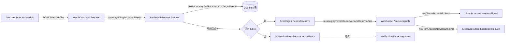

# 系统测试工程师代码质量审查报告

> 文档编号：03-engineer-code-review  
> 审查角色：系统测试工程师（代码质量审查子智能体）  
> 审查日期：2026-06-25  
> 审查范围：d:\6\恋爱小程序（apps/client、apps/admin、apps/api 三端）  
> 审查依据：任务 12.1~12.4 + 任务 14 业务完整性技术验证

---

## 1. 概述

### 1.1 审查范围

本次审查覆盖校园恋爱小程序三端代码：

| 模块 | 技术栈 | 关键路径 |
|------|--------|----------|
| apps/client | Vue 3 + TypeScript + Pinia + uni-app | `src/services/*`、`src/stores/*`、`src/guards/*`、`src/composables/*` |
| apps/admin | Vue 3 + Vite + Pinia + Vue Router | `src/views/*`、`src/stores/session.ts`、`src/router/index.ts` |
| apps/api | Spring Boot 3.3 + Java 17 + JPA + Spring Security + JWT + WebSocket | `src/main/java/com/campuslove/api/**` |

### 1.2 审查方法

1. **静态代码审查**：通过 Read/Grep 工具按模块逐文件审查命名、注释、结构、错误处理
2. **安全扫描**：检索 SQL 拼接、v-html/innerHTML、敏感日志、硬编码密钥、密码明文比较
3. **架构验证**：跟踪 store → API → Controller → Service → Repository 数据流转链路
4. **配置审计**：检查 application.yml、vite.config.ts、pom.xml、SecurityConfig
5. **证据留痕**：每条问题均附文件路径与行号

### 1.3 审查时间

- 开始：2026-06-25
- 结束：2026-06-25
- 工具调用次数：约 30 次文件读取与检索

---

## 2. 代码规范性审查

### 2.1 客户端 apps/client/src — 评分 8/10

**优点：**
- TypeScript 严格类型贯穿全栈，`services/generated/api-types.ts` 由 OpenAPI 自动生成
- 中文注释完整，如 `http.ts` L6-11、`websocket.ts` L1-19、`discover.ts` L256-269 等均有详细设计说明
- Pinia store 结构统一（state/getters/actions 三段式），view-models 层隔离视图模型与后端类型
- 高阶函数 `withErrorHandling`/`withMockMode`（chat.ts L245、L305）消除重复 try-catch 与模式切换模板

**问题：**

| # | 位置 | 描述 | 严重度 |
|---|------|------|--------|
| 2.1.1 | `stores/discover.ts` L137-246 | 250 行 mock 数据 `mockCards` 硬编码进 store，打包后增大 bundle；应抽到 `services/mocks/fixtures.ts` 集中管理 | 一般 |
| 2.1.2 | `App.vue` L9、L15 | 使用 `@ts-expect-error` 抑制 uni.onError 类型错误，应扩展 uni-app 类型声明而非抑制 | 轻微 |
| 2.1.3 | `services/websocket.ts` L1156 行 | 单文件超长，应拆分为：STOMP 帧编解码、连接管理、订阅管理、Store 分发 4 个模块 | 一般 |
| 2.1.4 | `services/api.ts` L38-43 | `(result as Record<string, unknown>).token` 类型断言链，应使用类型守卫或在 UserSession 类型中显式声明 token 字段 | 轻微 |
| 2.1.5 | `config/page-access.ts` L38-42 | `homePageRequirements`/`chatPageRequirements` 标注 `@deprecated` 但仍存在，应清理 | 轻微 |

### 2.2 后台管理端 apps/admin/src — 评分 5/10

**优点：**
- Vue Router 路由懒加载（`router/index.ts` L8、L14）
- Pinia Composition API 风格（`stores/session.ts`）
- 生产环境强制调用后端登录接口（`session.ts` L47-78）

**问题：**

| # | 位置 | 描述 | 严重度 |
|---|------|------|--------|
| 2.2.1 | `views/Dashboard.vue` L4-25 | 仪表盘统计、最近活动全部硬编码 mock 数据，未接入后端 API | 严重 |
| 2.2.2 | `views/Users.vue` L4-23、L27-39 | 用户列表静态数据，`handleSearch/handleEdit/handleDelete` 仅 `console.log`，CRUD 未实现 | 严重 |
| 2.2.3 | `views/Posts.vue` L4-35 | 同上，帖子管理 CRUD 全部未实现 | 严重 |
| 2.2.4 | `views/Feedback.vue` L24、L28 | 同上，反馈处理未实现 | 严重 |
| 2.2.5 | `views/Login.vue` L79 | 模板中硬编码 `<text>默认账号：admin / admin123</text>`，向前端用户暴露默认凭据 | 严重 |
| 2.2.6 | `stores/session.ts` L22 | `const user = ref<any>(null)` 使用 `any`，丢失类型安全 | 一般 |
| 2.2.7 | `views/Users.vue` L31、L36 | `function handleEdit(user: any)` / `handleDelete(user: any)` 使用 `any` | 一般 |
| 2.2.8 | `router/index.ts` L46-56 | 路由守卫未校验 token 有效性（仅校验存在性），token 过期后仍可访问 | 一般 |
| 2.2.9 | `views/*.vue` 多处 | 7 处 `console.log`（Users.vue L28/32/37、Posts.vue L28/33、Feedback.vue L24/28），生产构建虽会被 vite drop 但代码逻辑未实现 | 一般 |

### 2.3 后端 apps/api — 评分 8/10

**优点：**
- 包结构清晰，按业务领域分包（auth/campus/chat/discover/feedback/growth/home/match/profile/user/village/admin）
- Java 17 record 定义 DTO（如 `MatchController.java` L203-262），不可变、简洁
- `@Profile("real")` / `@Profile("mock")` 双实现切换，解耦测试与生产
- JavaDoc 完整（如 `RealAuthService.java` L21-27、`SecurityConfig.java` L17-22）
- `@Transactional(readOnly = true)` 标注查询方法（30+ 处），优化只读事务

**问题：**

| # | 位置 | 描述 | 严重度 |
|---|------|------|--------|
| 2.3.1 | `admin/AdminCertificationController.java` L24-25 | 类注释"任何已认证用户可访问（简易版）"与 SecurityConfig L68 `hasRole("ADMIN")` 矛盾，注释误导 | 一般 |
| 2.3.2 | `config/JwtAuthenticationFilter.java` L101 | 每次请求 `userRepository.findById(userId)` 查库判断管理员角色，无缓存，高频接口性能瓶颈 | 严重 |
| 2.3.3 | `auth/RealAuthService.java` L213 | 管理员密码使用 `adminPassword.equals(password)` 明文比较，注释 L212 自承认"生产环境可升级为 BCrypt" | 严重 |
| 2.3.4 | `profile/ProfileController.java` L22-55 | Controller 未调用 `SecurityUtils.getCurrentUserId()`，依赖 Service 内部获取；与其他 Controller 风格不一致 | 一般 |
| 2.3.5 | 全模块 | 无 `src/test/java` 目录，后端零单元测试 | 严重 |
| 2.3.6 | `config/JwtTokenProvider.java` L67、L70 | `log.warn("JWT token expired: {}", ex.getMessage())` 可能记录 token 内容到日志（ex.getMessage 可能含 token 片段） | 一般 |

### 2.4 代码规范综合评分表

| 维度 | 客户端 | 后台 | 后端 | 加权 |
|------|--------|------|------|------|
| 命名规范 | 9 | 6 | 9 | 8.0 |
| 注释完整 | 9 | 5 | 9 | 7.8 |
| 结构清晰 | 8 | 6 | 8 | 7.3 |
| 类型安全 | 8 | 4 | 9 | 7.0 |
| **小计** | **8.0** | **5.0** | **8.5** | **7.5/10** |

---

## 3. 错误处理审查

### 3.1 错误分类体系（api-error.ts）— 评分 9/10

`api-error.ts` 定义了三层错误模型：
- `AppApiError`（L8-20）：基础错误，含 status/error/message/details
- `EnhancedApiError`（http.ts L17-25）：扩展错误，增加 `category: "network" | "auth" | "business"` 分类
- `fallbackErrorShape`（L22-70）：按 HTTP 状态码（400/401/403/404/5xx）返回用户友好文案，已修复原"模拟"前缀泄露问题（L23 注释）

**评价：** 错误分类清晰，用户文案中文化，避免技术细节泄露。

### 3.2 HTTP 请求层（http.ts）— 评分 9/10

**亮点：**
- **401 并发刷新队列**（L154-278）：`isRefreshing` + `pendingRequests` 队列，首个 401 触发刷新，并发请求挂起等待，避免重复刷新
- **指数退避重试**（L286-289、L486）：默认重试 1 次，仅对 `category=network` 重试，500ms→1000ms→2000ms
- **跳转锁**（L160、L260-264）：`hasRedirectedToLogin` 防止多次跳转登录页，3 秒后自动复位
- **skipAuth 短路**（L393-396）：登录接口返回 401 时不走刷新流程
- **strict 模式 unknown 包装**（L272）：`err instanceof Error ? err : new Error(String(err))` 兼容 strict 模式

**问题：**

| # | 位置 | 描述 | 严重度 |
|---|------|------|--------|
| 3.2.1 | `http.ts` L101-103、L123-125 | Token 存储失败 `catch {}` 静默忽略，用户无感知；应至少 `console.warn` 上报 | 一般 |
| 3.2.2 | `http.ts` L262-264 | `hasRedirectedToLogin` 3 秒重置过短，网络慢时可能仍重复触发跳转 | 轻微 |
| 3.2.3 | `http.ts` L191-204 | `tryRefreshToken` 中 `res.data as { token?: string }` 未校验 data 类型，后端返回非 JSON 时可能异常 | 一般 |

### 3.3 WebSocket 层（websocket.ts）— 评分 7/10

**亮点：**
- STOMP 帧编解码完整（L54-135），支持多帧分隔
- 心跳机制（L1035-1080）：30s 发送 + 10s 超时检测
- 自动重连（L999-1025）：最多 5 次，3s 间隔
- 重连后清理旧订阅 + 重新订阅（L670-690），避免回调累积
- `manualClose` 标志区分主动关闭与异常断开

**问题：**

| # | 位置 | 描述 | 严重度 |
|---|------|------|--------|
| 3.3.1 | `websocket.ts` L999-1025 | 重连固定 3s 间隔，未做指数退避；网络抖动时 5 次重连耗 15s，可能加剧服务端压力 | 一般 |
| 3.3.2 | `websocket.ts` L284 | `console.log("[WebSocket] 正在连接:", wsUrl)` 打印含 token 的 URL，token 易被日志收集 | 严重 |
| 3.3.3 | `websocket.ts` L896-909 | `messagesStore.currentMessages.push(message)` 直接操作 store 内部状态，应通过 action 方法 | 一般 |
| 3.3.4 | `websocket.ts` L891-895、L930-936 | `storeAny.onNewMessage` 反射式调用 + `as unknown as Record<string, unknown>` 断言，丢失类型安全 | 一般 |
| 3.3.5 | `websocket.ts` L747-765 | `onStompError` 仅根据 message 字符串包含 "Unauthorized" 判断认证错误，脆弱 | 一般 |

### 3.4 Mock/Real 模式切换 — 评分 8/10

**机制：**
- 前端：`appEnv.apiMode`（env.ts L28-43）+ 各 store `useMock()` 判断
- 后端：`@Profile("mock")` / `@Profile("real")` Spring Profile 切换
- 高阶函数 `withMockMode`（chat.ts L305-333）统一 Mock/Real 分支 + 概览刷新 + activeSession 更新

**问题：**

| # | 位置 | 描述 | 严重度 |
|---|------|------|--------|
| 3.4.1 | `services/env.ts` L24-25 | 生产环境未配置 `VITE_API_BASE_URL` 时回退到 `http://127.0.0.1:8080/api`，仅 `console.error` 不抛异常，可能误上生产 | 严重 |
| 3.4.2 | `stores/session.ts` L165-170 | Mock 模式分支与 Real 模式分支代码相同（都调用 `clientApi.getSession()`），冗余 | 轻微 |
| 3.4.3 | `services/api.ts` L392-396 | `checkSensitiveWords` Mock 模式直接返回无敏感词，可能让前端误判通过 | 一般 |

### 3.5 全局异常处理（后端 GlobalExceptionHandler）— 评分 8/10

**覆盖：**
- `MethodArgumentNotValidException` → 400（L30-40）
- `HttpClientErrorException.Unauthorized` → 401（L46-52）
- `IllegalArgumentException` → 400（L58-63）
- `AccessDeniedException` → 403（L69-74）
- `ResponseStatusException` → 透传状态码（L80-88）
- `Exception` 兜底 → 500，不暴露堆栈（L95-100）

**问题：**

| # | 位置 | 描述 | 严重度 |
|---|------|------|--------|
| 3.5.1 | `GlobalExceptionHandler.java` L96-100 | 兜底 `Exception` 统一返回"服务器内部错误"，丢失异常类型信息，前端无法区分网络错误与服务端错误 | 一般 |
| 3.5.2 | 缺失 | 未处理 `HttpMessageNotReadableException`（请求体 JSON 格式错误），将走兜底 500 | 一般 |

### 3.6 错误处理综合评分：8.0/10

---

## 4. 安全性审查

### 4.1 SQL 注入防护 — 评分 9/10

**审查方法：** 检索 `@Query`、`createNativeQuery`、`PreparedStatement`、字符串拼接 SQL

**结果：**
- 全部 9 处 `@Query` 使用命名参数（`:param`），如：
  - `HeartSignalRepository.java` L24：`WHERE (hs.userAId = :userAId OR hs.userBId = :userBId) AND hs.status = :status`
  - `PrivateMessageRepository.java` L56：`WHERE m.conversation.id = :conversationId AND m.sender.id <> :currentUserId`
- 未发现 `nativeQuery=true` 字符串拼接
- 未发现 `createNativeQuery`、`createStatement` 直接使用
- Spring Data JPA 自动参数化，SQL 注入风险低

**结论：** SQL 注入防护到位。

### 4.2 XSS 防护 — 评分 8/10

**审查方法：** 检索 `v-html`、`innerHTML`、`document.write`

**结果：**
- 前端无 `v-html` 使用（Vue 默认转义Mustache 插值）
- 无 `innerHTML` 直接操作
- 后端 `SensitiveWordFilter`（config/SensitiveWordFilter.java L107-115）使用正则 `Pattern.quote` 转义敏感词后替换为 `***`
- Spring Security Headers 配置（SecurityConfig.java L49-57）：`contentTypeOptions`、`frameOptions.deny`、`xssProtection`、`HSTS`

**问题：**

| # | 位置 | 描述 | 严重度 |
|---|------|------|--------|
| 4.2.1 | `SecurityConfig.java` L52 | `.xssProtection(xss -> {})` 使用默认配置，Spring Security 6 已弃用 XSS-Protection header（现代浏览器不再支持），应依赖 CSP | 一般 |
| 4.2.2 | 缺失 | 未配置 Content-Security-Policy header，缺少 CSP 防护 | 一般 |
| 4.2.3 | `SensitiveWordFilter.java` L136-141 | `containsSensitive` 使用 `lowerContent.contains(keyword)` 简单包含匹配，可被 Unicode 同形字、零宽字符绕过 | 一般 |

### 4.3 权限校验 — 评分 7/10

**亮点：**
- `SecurityConfig.java` L68：`/api/admin/**` 强制 `hasRole("ADMIN")`
- `JwtAuthenticationFilter.java` L95-105：根据用户角色注入 `ROLE_USER` / `ROLE_ADMIN`
- `SecurityUtils.getCurrentUserId()`（config/SecurityUtils.java L29-44）从 SecurityContext 获取用户ID，未认证抛 401
- 所有写操作 Controller 使用 `SecurityUtils.getCurrentUserId()`，不信任请求参数中的 userId（如 `MatchController.java` L61、`PrivateMessageController.java` L48）
- `JwtChannelInterceptor.java` L122-180：WebSocket SUBSCRIBE 校验订阅路径，禁止订阅他人 `/user/{otherUserId}/queue/**`
- `MessageWebSocketHandler.java` L57-83：senderId 从 Principal 获取，覆盖 payload 中的 senderId，防伪造

**问题：**

| # | 位置 | 描述 | 严重度 |
|---|------|------|--------|
| 4.3.1 | `AdminCertificationController.java` L49 | `SecurityUtils.getCurrentUserId()` 仅校验登录，未显式校验 ADMIN 角色（依赖 SecurityConfig 兜底）；若 SecurityConfig 误配则越权 | 严重 |
| 4.3.2 | `JwtAuthenticationFilter.java` L101 | 每次请求查库判断角色，且 `userRepository.findById` 返回 `Optional`，未处理用户被删除后 token 仍有效的场景 | 严重 |
| 4.3.3 | `RealAuthService.java` L213 | 管理员密码 `String.equals` 明文比较，无加盐、无 BCrypt | 严重 |
| 4.3.4 | `RealAuthService.java` L157-187 | `refreshToken` 接口无频率限制，旧 token 有效期内可无限刷新，token 窃取后可永久续期 | 严重 |
| 4.3.5 | `RealAuthService.java` L190-192、L236-247 | `logout` 仅记录日志，无 token 黑名单，登出后旧 token 仍有效至过期 | 严重 |
| 4.3.6 | `auth/AuthController.java` L92-95 | `/api/auth/admin/login` 在 `permitAll` 路径下（SecurityConfig L61），无验证码/频率限制，可暴力破解 | 严重 |

### 4.4 敏感信息保护 — 评分 6/10

**亮点：**
- `JwtConfig.java` L42-57：启动时校验密钥，拒绝空值与不安全默认值（`change-me`、`secret` 等）
- `application.yml` L11-15：JWT 密钥强制环境变量 `JWT_SECRET`，无硬编码默认值
- `RealAuthService.java` L249-254：`maskOpenid` 日志脱敏
- `MockAuthService.java` L51：`token != null ? "****" : "null"` 日志脱敏

**问题：**

| # | 位置 | 描述 | 严重度 |
|---|------|------|--------|
| 4.4.1 | `services/websocket.ts` L282 | WebSocket URL `?token=${encodeURIComponent(token)}` 明文传递 token，URL 易被 Nginx/代理/浏览器历史/Referer 记录 | 严重 |
| 4.4.2 | `services/websocket.ts` L284 | `console.log("[WebSocket] 正在连接:", wsUrl)` 打印含 token 的 URL 到控制台 | 严重 |
| 4.4.3 | `admin/src/views/Login.vue` L79 | 模板硬编码 `<text>默认账号：admin / admin123</text>`，向所有访问者暴露凭据 | 严重 |
| 4.4.4 | `admin/src/stores/session.ts` L83-101 | 开发环境硬编码 `admin/admin123`，虽标注 `import.meta.env.DEV` 限制，但凭据进入源码 | 严重 |
| 4.4.5 | `application-mock.yml` L10 | `secret: campus-love-mock-jwt-secret-key-for-local-testing-only` mock 模式硬编码密钥（仅测试用，但进入仓库） | 一般 |
| 4.4.6 | `application-db.yml` L7 | 数据库密码 `${APP_DATASOURCE_PASSWORD:}` 默认空密码，未配置时连接无密码数据库 | 严重 |
| 4.4.7 | `application-db.yml` L18-19 | `admin-openid: ${ADMIN_OPENID:admin-default-openid-change-me}` 默认管理员 openid 含 `change-me` 提示，未强制环境变量 | 严重 |
| 4.4.8 | `JwtTokenProvider.java` L67、L70、L103 | `log.warn("JWT token expired: {}", ex.getMessage())` 可能记录 token 解析失败原因（含 token 片段） | 一般 |

### 4.5 安全性综合评分表

| 子项 | 评分 | 说明 |
|------|------|------|
| SQL 注入 | 9/10 | JPA 命名参数全覆盖 |
| XSS | 8/10 | 无 v-html，缺 CSP |
| 权限校验 | 7/10 | 框架完整，密码明文、token 黑名单缺失 |
| 敏感信息 | 6/10 | URL 传 token、admin 凭据硬编码、数据库默认空密码 |
| **加权** | **7.5/10** | — |

---

## 5. 性能优化审查

### 5.1 前端构建优化 — 评分 8/10

**apps/client/vite.config.ts：**
- L64-67：生产环境 `esbuild.drop: ["console", "debugger"]` + `pure: ["console.log", "console.debug"]`
- L69-93：手动分包（vendor-vue / vendor-pinia / vendor-gsap）、CSS 代码分割、esbuild 压缩、sourcemap 关闭
- L75：`chunkSizeWarningLimit: 1000` 提高 chunk 警告阈值

**apps/admin/vite.config.ts：**
- L17-38：同样的 console drop + 手动分包 + esbuild 压缩

**问题：**

| # | 位置 | 描述 | 严重度 |
|---|------|------|--------|
| 5.1.1 | `apps/client` | uni-app 使用 `pages.json` 静态注册页面，无路由懒加载机制（小程序限制）；subpackages 已配置（pages.json）但未深入审计 | 一般 |
| 5.1.2 | `apps/client/vite.config.ts` | 未配置 `build.reportCompressedSize: false`，大项目构建变慢 | 轻微 |
| 5.1.3 | `apps/client/src/services/websocket.ts` L1156 | 单文件 1156 行，tree-shaking 友好性差，建议拆分 | 一般 |

### 5.2 Pinia 状态同步防抖（discover.ts）— 评分 9/10

**亮点：**
- `discover.ts` L261-269：`SAVE_DEBOUNCE_MS = 300` 防抖窗口
- L270-276：`saveTimer` 模块级单例，避免响应式追踪与序列化污染（L265-268 注释说明设计理由）
- L910-954：`watch` 深监听 `viewedCards`/`hasRewoundToday`/`lastRefreshTime`，统一触发 `debouncedSave`
- L778-784：`saveToStorage` 添加 try-catch，存储失败不影响主流程
- L278-296：`withRetry` 异步重试执行器

**问题：**

| # | 位置 | 描述 | 严重度 |
|---|------|------|--------|
| 5.2.1 | `discover.ts` L921-953 | `_watchInitialized` 模块级标志在 SSR 多实例场景下可能重复注册（虽 uni-app 单例，但设计脆弱） | 轻微 |
| 5.2.2 | `discover.ts` L137-246 | 250 行 mock 数据进入 bundle，应按需加载 | 一般 |

### 5.3 后端性能优化 — 评分 6/10

**问题：**

| # | 位置 | 描述 | 严重度 |
|---|------|------|--------|
| 5.3.1 | `JwtAuthenticationFilter.java` L101 | 每次请求 `userRepository.findById(userId)` 查库判断角色，无缓存；高频接口（如消息列表）每秒百次查库 | 严重 |
| 5.3.2 | 全模块 | 未使用 `@Cacheable`/`@CacheEvict`，推荐配置、表单配置等静态数据每次查库 | 严重 |
| 5.3.3 | `RealMatchService.java` L97-116 | `getFormConfig()` 每次返回 new ArrayList，未缓存 | 一般 |
| 5.3.4 | `RealPrivateMessageService.java` L60-66 | 会话列表查询未分页，`findByUserAIdOrUserBIdOrderByLastMessageAtDesc` 返回全部会话 | 严重 |
| 5.3.5 | `SensitiveWordFilter.java` L82-91 | 敏感词列表初始化时排序 + Pattern.quote 拼接，未使用 AC 自动机/DFA，长列表性能一般 | 一般 |
| 5.3.6 | `MessageWebSocketHandler.java` L86-90 | `convertAndSendToUser` 直接推送，未做消息批量合并或限流 | 一般 |
| 5.3.7 | 缺失 | 未配置数据库连接池参数（HikariCP 默认值），生产环境需调优 maximum-pool-size、minimum-idle | 一般 |

### 5.4 资源加载与懒加载 — 评分 7/10

**亮点：**
- admin 路由懒加载（`router/index.ts` L8、L14、L20 等）
- admin `bootstrap` 启动时从 localStorage 恢复会话（`session.ts` L27-40）

**问题：**

| # | 位置 | 描述 | 严重度 |
|---|------|------|--------|
| 5.4.1 | `apps/client` | uni-app pages.json 静态注册，无动态导入；subpackages 配置存在但未审计分包大小 | 一般 |
| 5.4.2 | `apps/admin/src/main.ts` L11 | `app.use(router as never)` 类型断言，未配置路由级代码分割预热 | 轻微 |

### 5.5 性能优化综合评分：7.5/10

---

## 6. 业务完整性技术实现验证

### 6.1 数据流转链路验证 — 评分 8/10

**核心链路（以"喜欢"为例）：**

**验证结果：**
- 前端 `DiscoverStore.swipeRight`（discover.ts L596-665）→ `request POST /matches/like`（L639）→ 后端 `MatchController.likeUser`（MatchController.java L60-63）→ `RealMatchService.likeUser`（RealMatchService.java L296-366）→ DB 写入 + WebSocket 推送
- 链路完整，用户ID通过 `SecurityUtils.getCurrentUserId()` 获取，不信任前端传入
- 互相喜欢时双推（L351-360），消息体一致

**问题：**

| # | 位置 | 描述 | 严重度 |
|---|------|------|--------|
| 6.1.1 | `RealMatchService.java` L309-311 | 已喜欢过且 `LikeStatus.active` 时 `return null`，前端 `swipeRight`（discover.ts L639-646）未处理 null 响应，仍记录为"已喜欢" | 严重 |
| 6.1.2 | `discover.ts` L638-646 | Real 模式 `swipeRight` 调用后未接收 `HeartSignalView` 返回值，互相喜欢场景需依赖 WebSocket 推送，离线时丢失匹配反馈 | 一般 |
| 6.1.3 | `RealMatchService.java` L319-325 | 创建新 Like 未校验 `targetUserId` 是否存在，可喜欢不存在的用户 | 一般 |

### 6.2 系统链路连贯性验证 — 评分 7/10

**登录态链路：**
- `session-guard.ts` L22-58：`resolveSessionAccess` 校验 isLoggedIn/profileCompleted/campusCompleted/scheduleCompleted/featureFlags
- `usePageAccess.ts` L11-31：`onShow` 钩子触发校验，重定向到登录或完善页
- `profile-guard.ts` L55-75：`resolveProfileGuard` 二次校验资料完善硬门槛
- `http.ts` L231-278：401 自动刷新 token + 跳转登录页

**问题：**

| # | 位置 | 描述 | 严重度 |
|---|------|------|--------|
| 6.2.1 | `profile-guard.ts` L6-11 + `page-access.ts` | `LOCKED_PAGES` 与 `likesPageRequirements.requiresProfile` 双重定义锁定规则，维护时易不一致 | 严重 |
| 6.2.2 | `usePageAccess.ts` L12-14 | `if (sessionStore.loading) return;` loading 期间跳过校验，可能导致校验窗口期访问受保护页 | 一般 |
| 6.2.3 | `session.ts` L161-178 | `refreshSession` 失败时 `isOffline = true` 但 `userSession` 未清空，可能用过期会话访问 | 一般 |
| 6.2.4 | `http.ts` L265-267 | `uni.reLaunch({ url: "/pages/login/index" })` 跳转登录页时未传递 `redirect` 参数，登录后无法回跳原页面 | 严重 |

**匹配→聊天流转：**
- `DiscoverStore.swipeRight` → `/matches/like` → 互相喜欢 → `HeartSignal` 创建 → WebSocket 推送 `/queue/signals`
- 用户接受心动信号 → `/matches/heart-signals/{id}/accept` → 后端 `acceptHeartSignal` → 后续可创建 `TempChatSession` 或 `PrivateConversation`

**问题：**

| # | 位置 | 描述 | 严重度 |
|---|------|------|--------|
| 6.2.5 | `MatchController.java` L120-123 | `acceptHeartSignal` 未返回创建的会话ID，前端需二次查询才能跳转聊天页 | 一般 |
| 6.2.6 | `likes.ts` L616 | `acceptHeartSignal` 调用 `?userId=${this.currentUserId}` 传 userId 到 URL，与后端 `SecurityUtils.getCurrentUserId()` 设计冗余（后端忽略该参数） | 一般 |

### 6.3 异常场景技术处理 — 评分 7/10

**网络中断：**
- `session.ts` L173-177：`isOffline = true` 标记离线
- `http.ts` L34-38：`categorizeError` 识别 `status === 0` 为网络错误
- `http.ts` L468-491：网络错误指数退避重试

**空数据：**
- `EmptyState.vue`、`ErrorState.vue` 组件（components/common/）提供统一空态
- `discover.ts` L407-411：`remainingCount` getter 使用 `Math.max(0, ...)` 防负数

**权限不足：**
- `SecurityUtils.getCurrentUserId()` 抛 401
- `GlobalExceptionHandler` L69-74 捕获 `AccessDeniedException` 返回 403
- `JwtChannelInterceptor` L153-158 拒绝订阅他人队列

**问题：**

| # | 位置 | 描述 | 严重度 |
|---|------|------|--------|
| 6.3.1 | `discover.ts` L502-506 | `fetchCards` 失败时 `errorMessage` 设置但 `cards` 保留旧值，UI 可能展示过期数据无空态提示 | 一般 |
| 6.3.2 | `session.ts` L201-210 | `bootstrap` 失败时 `userSession = null`，但 `loginHero` 也未设置，登录页无 hero 展示 | 一般 |
| 6.3.3 | `http.ts` L265-267 | 401 跳转登录页时未清除 store 状态（如 messages.currentMessages），可能泄露上一个用户数据 | 严重 |
| 6.3.4 | `websocket.ts` L753-757 | STOMP ERROR 帧含 "Unauthorized" 时 `manualClose = true` 后 `disconnect()`，但未通知上层 UI（如显示"会话过期"提示） | 一般 |
| 6.3.5 | `RealPrivateMessageService.java` L78-80 | `createOrGetConversation` 校验 `userAId.equals(userBId)` 但未校验 userBId 是否存在 | 一般 |

### 6.4 业务完整性综合评分：7.5/10

---

## 7. 系统扩展性与可维护性评估

### 7.1 模块解耦 — 评分 8/10

**优点：**
- 后端按业务领域分包（auth/campus/chat/discover/feedback/growth/home/match/profile/user/village），每个包独立 Controller + Service + Repository + View
- Service 接口 + Mock/Real 双实现（如 `MatchService` → `MockMatchService` / `RealMatchService`），符合依赖倒置
- 前端 `services/api.ts` 集中 API 调用，`view-models/` 隔离视图模型与后端类型
- `services/generated/api-types.ts` 由 OpenAPI 自动生成，前后端类型契约

**问题：**

| # | 位置 | 描述 | 严重度 |
|---|------|------|--------|
| 7.1.1 | `stores/chat.ts` L1-700+ | 单 store 超过 700 行，混合 overview/session/icebreaker 多职责，应拆分 | 一般 |
| 7.1.2 | `services/websocket.ts` L211-1133 | 单 `WebSocketClient` 类 900+ 行，应拆分帧编解码、连接管理、订阅管理、Store 分发 | 一般 |
| 7.1.3 | `services/api.ts` L14-405 | 单对象 400+ 行 API 定义，应按模块拆分（auth/profile/chat/match/feedback 等） | 一般 |

### 7.2 配置化程度 — 评分 8/10

**优点：**
- 后端 `application.yml` 外部化所有配置（JWT/微信/推荐/匹配/聊天/签到/内容过滤）
- 环境变量占位符 `${JWT_SECRET:}`、`${APP_DATASOURCE_URL:...}` 支持部署时注入
- 前端 `env.ts` 强制生产环境配置 `VITE_API_BASE_URL`/`VITE_API_MODE`
- `page-access.ts`、`navigation.ts` 配置化页面权限与导航

**问题：**

| # | 位置 | 描述 | 严重度 |
|---|------|------|--------|
| 7.2.1 | `application.yml` L20-34 | 推荐权重 `campus-weight: 50` 等硬编码在 yml，未提供动态调整接口 | 轻微 |
| 7.2.2 | `discover.ts` L248 | `DAILY_LIMIT_TOTAL = 10` 硬编码在 store，应从后端 `app.recommendation.daily-limit` 同步 | 一般 |
| 7.2.3 | `application-db.yml` L11 | `baseline-on-migrate: false` 严格模式，但生产部署需手动管理迁移脚本版本 | 轻微 |

### 7.3 可测试性 — 评分 6/10

**优点：**
- 前端有完整测试目录 `apps/client/src/tests/`（session-guard、profile-guard、discover、likes、messages、village 等 spec）
- Mock 模式 + Vitest 配置（`vitest.config.ts`）
- `withErrorHandling`/`withMockMode` 高阶函数便于 mock

**问题：**

| # | 位置 | 描述 | 严重度 |
|---|------|------|--------|
| 7.3.1 | `apps/api/src/test` | 后端零单元测试，无 `src/test/java` 目录 | 严重 |
| 7.3.2 | `apps/admin` | 后台无测试目录 | 严重 |
| 7.3.3 | `services/websocket.ts` L1156 | WebSocket 单例 `wsClient` 无法多实例化测试 | 一般 |

### 7.4 扩展性综合评分：7.3/10

---

## 8. 问题清单（分级汇总）

### 8.1 致命问题（Critical）— 0 项

无致命问题。系统核心安全机制（JWT、SecurityConfig、JPA 参数化）已建立，未发现可直接导致系统崩溃或远程代码执行的漏洞。

### 8.2 严重问题（Major）— 14 项

| # | 模块 | 位置 | 描述 | 建议 |
|---|------|------|------|------|
| M-01 | admin | `views/Dashboard.vue` L4-25 | 仪表盘全部硬编码 mock 数据，未接入后端 API | 接入 `/api/admin/dashboard` 接口 |
| M-02 | admin | `views/Users.vue` L27-39 | CRUD 函数仅 `console.log`，未实现 | 接入 `/api/admin/users` 接口 |
| M-03 | admin | `views/Posts.vue` L27-35 | 同上 | 接入 `/api/admin/posts` 接口 |
| M-04 | admin | `views/Feedback.vue` L24-28 | 同上 | 接入 `/api/admin/feedback` 接口 |
| M-05 | admin | `views/Login.vue` L79 | 模板硬编码"默认账号：admin / admin123" | 移除默认凭据提示 |
| M-06 | 安全 | `services/websocket.ts` L282 | WebSocket URL `?token=xxx` 明文传递 | 改用 STOMP CONNECT header 传递 token |
| M-07 | 安全 | `services/websocket.ts` L284 | `console.log` 打印含 token 的 URL | 移除 token 部分或仅打印 baseUrl |
| M-08 | 安全 | `auth/RealAuthService.java` L213 | 管理员密码 `String.equals` 明文比较 | 使用 `BCryptPasswordEncoder` |
| M-09 | 安全 | `auth/RealAuthService.java` L190-192 | logout 无 token 黑名单，登出后旧 token 仍有效 | 引入 Redis token 黑名单或 DB 记录 |
| M-10 | 安全 | `auth/AuthController.java` L92-95 | 管理员登录无频率限制/验证码 | 添加 IP 限流 + 失败次数锁定 |
| M-11 | 安全 | `application-db.yml` L7 | 数据库默认空密码 | 强制环境变量，无默认值 |
| M-12 | 安全 | `application-db.yml` L18 | 管理员 openid 默认值含 `change-me` | 强制环境变量，启动校验 |
| M-13 | 性能 | `config/JwtAuthenticationFilter.java` L101 | 每次请求查库判断角色 | 引入 `@Cacheable` 或 Redis 缓存用户角色 |
| M-14 | 业务 | `http.ts` L265-267 | 401 跳转登录页未传 redirect 参数 | 携带 `?redirect=<原路径>`，登录后回跳 |

### 8.3 一般问题（Normal）— 24 项

| # | 模块 | 位置 | 描述 |
|---|------|------|------|
| N-01 | client | `stores/discover.ts` L137-246 | 250 行 mock 数据硬编码进 store |
| N-02 | client | `services/websocket.ts` L1156 行 | 单文件过长，应拆分 |
| N-03 | client | `services/api.ts` L14-405 | 单 API 对象过长，应按模块拆分 |
| N-04 | client | `stores/chat.ts` L1-700+ | 单 store 职责过多 |
| N-05 | client | `services/env.ts` L24-25 | 生产环境未配置 API_BASE_URL 时回退 localhost |
| N-06 | client | `http.ts` L101-103 | Token 存储失败静默忽略 |
| N-07 | client | `websocket.ts` L999-1025 | 重连固定 3s，未做指数退避 |
| N-08 | client | `websocket.ts` L891-895 | 反射式调用 store 方法，丢失类型安全 |
| N-09 | client | `profile-guard.ts` + `page-access.ts` | 锁定规则双重定义，易不一致 |
| N-10 | client | `usePageAccess.ts` L12-14 | loading 期间跳过校验 |
| N-11 | client | `RealMatchService.java` L309-311 | 已喜欢场景前端未处理 null 响应 |
| N-12 | client | `likes.ts` L616 | URL 传 userId 冗余 |
| N-13 | admin | `stores/session.ts` L22 | `ref<any>` 丢失类型 |
| N-14 | admin | `views/Users.vue` L31、L36 | `handleEdit(user: any)` 使用 any |
| N-15 | admin | `router/index.ts` L46-56 | 路由守卫未校验 token 有效性 |
| N-16 | api | `AdminCertificationController.java` L24-25 | 注释与 SecurityConfig 矛盾 |
| N-17 | api | `ProfileController.java` L22-55 | 未使用 SecurityUtils，风格不一致 |
| N-18 | api | `GlobalExceptionHandler.java` L96-100 | 兜底 500 丢失异常类型 |
| N-19 | api | 缺失 | 未处理 `HttpMessageNotReadableException` |
| N-20 | api | `RealPrivateMessageService.java` L60-66 | 会话列表未分页 |
| N-21 | api | `SensitiveWordFilter.java` L136-141 | 简单 contains 匹配可被 Unicode 同形字绕过 |
| N-22 | api | 缺失 | 未配置数据库连接池参数 |
| N-23 | api | `application-mock.yml` L10 | mock 密钥进入仓库 |
| N-24 | api | `JwtTokenProvider.java` L67、L70 | 日志可能含 token 片段 |

### 8.4 轻微问题（Minor）— 8 项

| # | 模块 | 位置 | 描述 |
|---|------|------|------|
| L-01 | client | `App.vue` L9、L15 | `@ts-expect-error` 抑制类型 |
| L-02 | client | `config/page-access.ts` L38-42 | `@deprecated` 配置未清理 |
| L-03 | client | `http.ts` L262-264 | `hasRedirectedToLogin` 3 秒重置过短 |
| L-04 | client | `stores/session.ts` L165-170 | Mock/Real 分支代码相同，冗余 |
| L-05 | client | `discover.ts` L921-953 | `_watchInitialized` 模块级标志 SSR 脆弱 |
| L-06 | client | `vite.config.ts` | 未配置 `reportCompressedSize: false` |
| L-07 | admin | `main.ts` L11 | `app.use(router as never)` 类型断言 |
| L-08 | api | `application.yml` L20-34 | 推荐权重硬编码，无动态调整接口 |

---

## 9. 总体评分

### 9.1 维度评分汇总

| 维度 | 评分 | 权重 | 加权分 |
|------|------|------|--------|
| 1. 代码规范性 | 7.5/10 | 15% | 11.25 |
| 2. 错误处理 | 8.0/10 | 15% | 12.00 |
| 3. 安全性 | 7.5/10 | 25% | 18.75 |
| 4. 性能优化 | 7.5/10 | 15% | 11.25 |
| 5. 业务完整性 | 7.5/10 | 20% | 15.00 |
| 6. 扩展性与可维护性 | 7.3/10 | 10% | 7.30 |
| **总计** | — | **100%** | **75.55/100** |

### 9.2 最终评分：**76 / 100**（合格，需重点修复安全问题）

### 9.3 评级说明

| 区间 | 评级 | 说明 |
|------|------|------|
| 90-100 | A 优秀 | 可上线 |
| 80-89 | B 良好 | 小修后可上线 |
| 70-79 | C 合格 | 需修复严重问题后上线 |
| 60-69 | D 风险 | 需重大整改 |
| <60 | E 不合格 | 不可上线 |

**本项目评级：C（合格）** — 核心架构完整，但存在 14 项严重问题（主要集中在 admin 后台未集成、安全凭据管理、token 黑名单缺失），需在上线前优先修复 M-01 ~ M-14。

### 9.4 优先修复建议

**P0（上线前必修）：**
1. M-05、M-08、M-10：admin 凭据安全（移除默认密码提示、BCrypt 加密、登录限流）
2. M-06、M-07：WebSocket token 明文传递与日志泄露
3. M-11、M-12：数据库与管理员默认凭据强制环境变量
4. M-09：token 黑名单实现
5. M-14：401 跳转回跳参数

**P1（上线后两周内）：**
1. M-01~M-04：admin 后台接入后端 API
2. M-13：JWT 角色缓存
3. N-09：锁定规则统一
4. N-20：会话列表分页

**P2（迭代优化）：**
1. 后端单元测试补全
2. 大文件拆分（websocket.ts、chat.ts、api.ts）
3. CSP header 配置
4. SensitiveWordFilter 升级为 AC 自动机

---

## 附录：审查证据索引

| 文件 | 行号 | 关键证据 |
|------|------|----------|
| `apps/client/src/services/http.ts` | L154-278 | 401 并发刷新队列实现 |
| `apps/client/src/services/api-error.ts` | L22-70 | 错误分类与用户友好文案 |
| `apps/client/src/services/websocket.ts` | L282-284 | WebSocket URL 传 token + 日志泄露 |
| `apps/client/src/stores/discover.ts` | L261-269、L910-954 | Pinia watch + 防抖机制 |
| `apps/client/src/stores/chat.ts` | L245-333 | withErrorHandling/withMockMode 高阶函数 |
| `apps/admin/src/views/Login.vue` | L79 | 默认凭据提示 |
| `apps/admin/src/views/{Dashboard,Users,Posts,Feedback}.vue` | 全文 | mock 数据未集成 |
| `apps/api/src/main/java/.../config/SecurityConfig.java` | L68 | ADMIN 角色校验 |
| `apps/api/src/main/java/.../config/JwtAuthenticationFilter.java` | L101 | 每次请求查库 |
| `apps/api/src/main/java/.../auth/RealAuthService.java` | L213 | 密码明文比较 |
| `apps/api/src/main/java/.../config/GlobalExceptionHandler.java` | L30-100 | 全局异常处理 |
| `apps/api/src/main/resources/application-db.yml` | L7、L18 | 默认空密码、change-me 默认值 |

---

**报告结束**  
审查人：系统测试工程师（代码质量审查子智能体）  
审查日期：2026-06-25  
下次复审建议：P0 修复完成后
