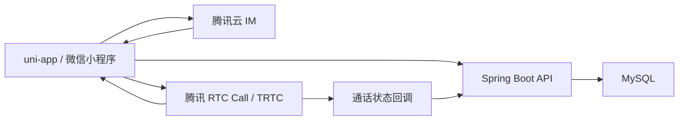
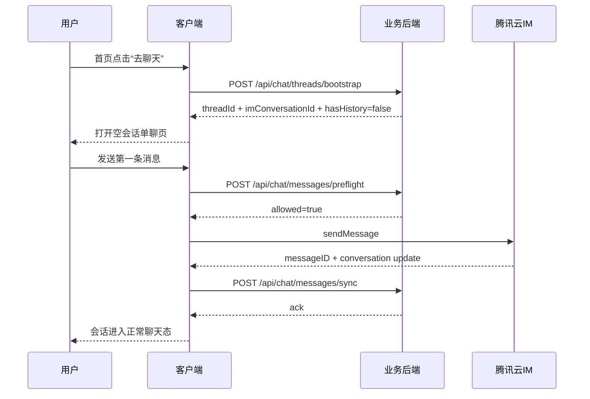
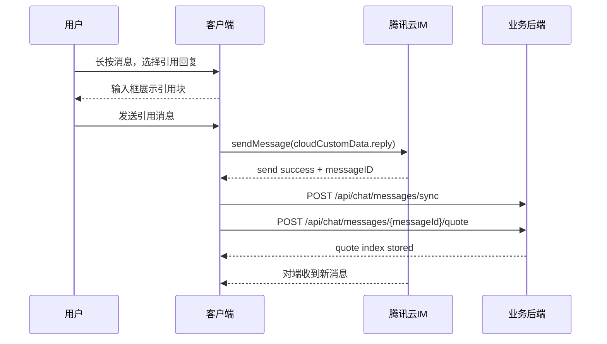
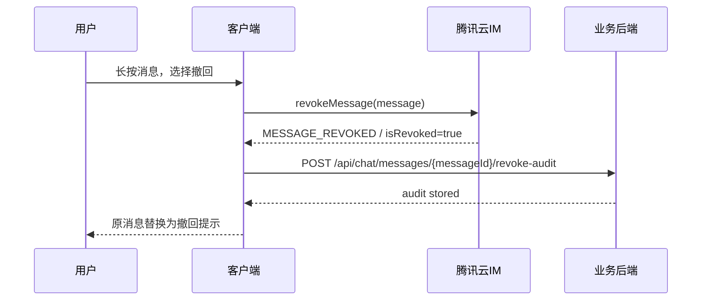
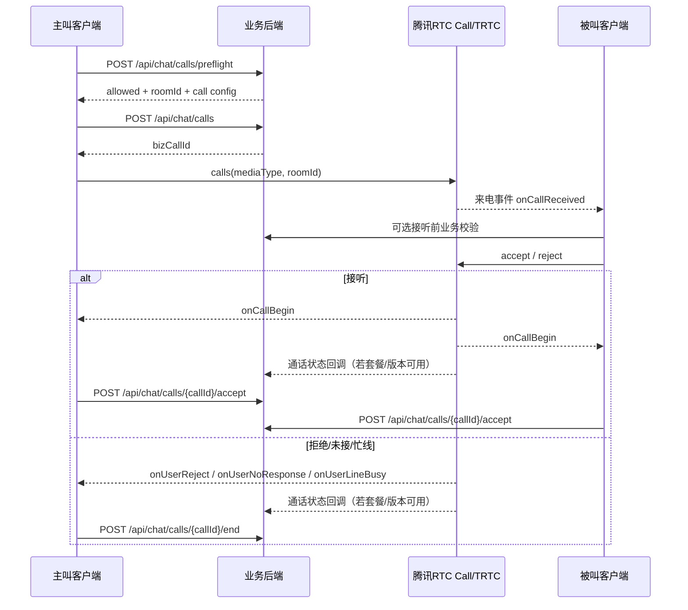

# 历史参考：当前仓库执行以 `docs/phase-1-execution-plan.md` 为准
#
# 本文只保留为未来独立产品的全量架构草案。当前仓库仅继承其中的
# `首页 / 讨论圈 / 匹配 / 聊天 / 我的` 一级结构、推荐链路、活动二级入口
# 与临时匿名聊天边界；IM/RTC、撤回、引用回复、图片消息与长期会话规则
# 均不属于当前交付范围。

# 校园恋爱小程序聊天与通话混合架构设计

日期：2026-05-18  
状态：历史参考，当前仓库不直接按本文交付  
范围：首页课表驱动推荐、推荐人直达聊天、活动底部抽屉、会话列表、单聊、撤回、引用回复、语音/视频通话、后端控制层

## 1. 设计结论

本项目采用混合架构：

- 实时消息底层：腾讯云 IM
- 音视频通话底层：腾讯云 TRTC / Call
- 业务体验层：客户端与业务后端完全自研
- 业务控制层：Spring Boot + MySQL

该方案的目标是同时满足三件事：

1. 用成熟 SDK 解决消息连接、媒体传输、富媒体消息、会话同步、通话信令与通话媒体链路。
2. 保留首页、推荐链路、聊天列表、单聊页、活动抽屉、撤回、引用回复等体验的完整控制权。
3. 把推荐、风控、权限、审计、摘要重算、通话记录等业务责任留在自己的后端。

## 2. 目标与非目标

### 2.1 目标

- 首页固定顺序为 `课表推荐 -> 推荐的人 -> 活动入口`
- 推荐的人支持从首页直接进入单聊
- 活动以 `底部抽屉` 打开，不占首页主内容
- 聊天 tab 先进入 `会话列表`
- 当没有最近会话时，聊天页整页切为 `推荐的人`
- 单聊支持：
  - 文本
  - 图片
  - 语音入口
  - 表情入口
  - 更多面板
  - 时间分隔
  - 已读态
  - 撤回
  - 引用回复
  - 语音通话
  - 视频通话
- 后端具备真实可落地的数据模型、接口边界、审计与回调接入点

### 2.2 非目标

- 不在本阶段复制完整微信生态
- 不做群聊
- 不做红包、转账、朋友圈、通讯录、公众号
- 不做自建 IM 长连接系统
- 不做自建 SFU / MCU / WebRTC 媒体平台

## 3. 官方能力边界

以下内容直接来自官方文档，属于本设计的硬约束。

### 3.1 腾讯云 IM 小程序与 uni-app 兼容性

腾讯云 IM 官方文档明确说明，微信小程序环境兼容原生微信小程序以及 uni-app 打包的小程序；V4 SDK 为 `@tencentcloud/lite-chat`。标准版支持历史消息、消息操作、已读回执、消息扩展、图片/视频/语音/文件消息、会话列表、会话操作与云端搜索等能力。  
来源：

- [即时通信 IM 小程序 & uni-app](https://cloud.tencent.com/document/product/269/117335)

### 3.2 小程序域名白名单是必配项

IM SDK 在小程序中集成时，需要配置 socket、request、uploadFile 合法域名。该配置必须纳入客户端接入清单，否则消息与媒体链路不会稳定可用。  
来源：

- [即时通信 IM 小程序 & uni-app](https://cloud.tencent.com/document/product/269/117335)

### 3.3 Web/小程序/uni-app 无本地历史消息

官方文档明确说明：由于平台限制，Web、小程序、uni-app 无法支持本地历史消息，只能拉取云端存储的历史消息。  
这意味着：

- 聊天历史不能依赖纯本地离线存储模型
- 会话首屏与翻页都要围绕云端消息拉取设计
- 会话摘要与推荐命中如果需要强业务语义，必须在自己的业务库中另存索引

来源：

- [历史消息 Web&小程序&uni-app](https://cloud.tencent.com/document/product/269/75322)

### 3.4 撤回能力由 IM 提供

官方文档明确支持 `revokeMessage`；撤回成功后消息对象 `isRevoked` 为 `true`，并会收到 `MESSAGE_REVOKED` 事件。  
来源：

- [撤回消息 Web&小程序&uni-app](https://cloud.tencent.com/document/product/269/75338)

### 3.5 引用回复建议基于消息变更与 `cloudCustomData`

官方文档明确提到：可以通过消息变更 API 修改消息的 `cloudCustomData` 来实现“消息回复、引用”等功能。  
这里需要区分两层：

- 官方明确支持的是：消息对象可携带并同步 `cloudCustomData`
- 本设计的做法是：发送“新消息”时写入被引用消息的元信息，并在必要时用消息变更更新附加字段

后者是基于官方能力的业务实现推断，而不是官方内建“引用回复 UI”。  
来源：

- [消息变更 Web&小程序&uni-app](https://cloud.tencent.com/document/product/269/75328)

### 3.6 已读回执有套餐要求

官方文档明确说明：消息已读回执需要发送消息时设置 `needReadReceipt: true`；接收端查看后调用 `sendMessageReadReceipt`；该能力需要旗舰版或企业版套餐。  
来源：

- [已读回执 Web&小程序&uni-app](https://cloud.tencent.com/document/product/269/75344)

### 3.7 TUICallEngine 适合自定义 UI

腾讯 RTC 文档明确说明：`TUICallEngine` 是无 UI 接口；如果 `TUICallKit` 交互不满足要求，可以使用 `TUICallEngine` 自定义封装。其 API 包含 `init`、`calls`、`accept`、`reject`、`hangup`、`openCamera`、`openMicrophone`、`switchCallMediaType`，以及 `onCallReceived`、`onCallBegin`、`onCallEnd`、`onUserReject`、`onUserNoResponse`、`onUserLineBusy` 等观察者回调。  
来源：

- [TUICallKit / TUICallEngine 接口概述](https://trtc.io/zh/document/51010)

### 3.8 服务端通话状态回调有版本与套餐边界

腾讯 RTC 文档当前说明：通话状态回调需开启 Call（TUICallKit）群组通话版，并配置回调 URL；微信小程序侧需达到对应最低版本。  
这说明通话状态回调不能被当成“默认总可用”的能力，落地前必须确认所购套餐与 SDK 版本。  
来源：

- [音视频通话状态回调详解](https://trtc.io/zh/document/60130)

## 4. 体验设计

## 4.1 首页

首页固定为三段式：

1. `课表推荐`
2. `推荐的人`
3. `活动入口`

### 4.1.1 课表推荐

首页第一卡只解决“我今天什么时候适合行动”：

- 今日课程摘要
- 空档识别
- 推荐时间窗
- `课表设置`
- `推荐偏好`
- `关注管理`

### 4.1.2 推荐的人

首页第二段展示推荐人卡片，排序因子：

- 同校优先
- 共同空档
- 共同关注
- 共同活动
- 地理距离
- 活跃度

每张卡片具备：

- 头像、昵称、学校/校区、共同点
- 最近可社交时间窗
- `去聊天` 主按钮

点击 `去聊天`：

- 若已有 C2C 会话，直接进入单聊页
- 若无历史会话，进入空会话单聊页

### 4.1.3 活动入口

首页不常驻活动列表，只展示活动摘要入口。点击后从底部拉起活动抽屉。

活动抽屉内容：

- 今晚可参加
- 本校活动
- 已收藏活动
- 距离近且与课表不冲突

## 4.2 聊天 tab

聊天 tab 有两种入口状态：

### 4.2.1 有最近会话

展示微信式会话列表：

- 头像
- 昵称
- 最后一条消息摘要
- 时间
- 未读数
- 置顶标记
- 搜索

### 4.2.2 无最近会话

整页显示推荐的人：

- 每张卡可直接进入单聊
- 不在此页混入会话列表
- 第一条消息发出后，系统才生成最近会话

## 4.3 单聊页

单聊页为基础聊天能力页：

- 文本消息
- 图片消息
- 时间分隔线
- 已读态
- 表情入口
- 图片入口
- 语音入口
- 更多面板
- 语音通话
- 视频通话
- 引用回复
- 撤回

说明：

- “语音入口”在这里指聊天输入区的语音消息/录音入口
- “语音通话/视频通话”是顶部即时通话入口

## 5. 系统架构



## 5.1 职责分层

### 客户端职责

- 首页课表与推荐人展示
- 活动底部抽屉
- 聊天列表与单聊 UI
- 撤回、引用回复、会话空状态
- 通话前台状态机

### 腾讯云 IM 职责

- 实时消息连接
- 消息投递
- 云端历史消息
- 富媒体消息
- 会话列表基础能力
- 已读回执
- 消息撤回

### 腾讯 RTC 职责

- 通话呼叫信令能力
- 音视频房间
- 采集、编解码、网络自适应
- 通话生命周期观察者
- 服务器侧通话状态回调（受版本与套餐限制）

### 业务后端职责

- 推荐链路
- 用户关系与权限
- 陌生人来电策略
- 拉黑、静默、限频
- 会话影子索引
- 引用回复索引
- 撤回审计
- 通话记录
- 活动抽屉数据
- 首页配置

## 6. 核心业务模型

## 6.1 会话模型

客户端展示使用 IM 的 `conversationID` 作为实时会话键。  
业务后端额外维护自己的 `thread_id`，用于承接：

- 推荐链路
- 风控
- 业务标签
- 会话来源
- 会话冷启动
- 审计与 BI

建议映射关系：

- `thread_id`：业务主键
- `im_conversation_id`：如 `C2C_userA_userB`
- `thread_source`：`home_recommendation` / `chat_empty_state` / `activity_match`
- `first_touch_scene`：首次建联场景

## 6.2 首条消息建联

当用户从首页推荐人点击进入聊天：

- 先进入空会话单聊页
- 不自动代发消息
- 用户发送第一条消息后：
  - IM 生成真实 C2C 会话
  - 业务后端创建 `conversation_thread`
  - 会话列表开始出现该会话

## 6.3 引用回复模型

引用回复不修改被引用消息的主体内容，而是发送一条新消息，并在业务侧与消息附加字段中保存引用关系。

建议 `cloudCustomData` 结构：

```json
{
  "bizVersion": 1,
  "messageScene": "chat",
  "reply": {
    "quotedMessageID": "im-msg-001",
    "quotedSenderId": "u_1002",
    "quotedType": "text",
    "quotedAbstract": "今晚毕业展结束后可以顺路坐一会儿。",
    "quotedAt": "2026-05-18T14:35:10+08:00"
  }
}
```

业务库同时落一条 `message_quote_ref`，用于：

- 引用链校验
- 被引用消息失效后回填
- 审计
- 搜索命中

说明：

- 使用 `cloudCustomData` 实现引用块是基于官方能力的实现推断
- 客户端不可仅依赖本地内存引用，否则历史翻页后无法稳定渲染

## 6.4 撤回模型

撤回分为三层：

1. `IM 层撤回`  
   通过 `revokeMessage` 发起，消息对象变为 `isRevoked = true`

2. `业务层审计`  
   后端记录谁、何时、在哪个 thread 中、撤回了哪条消息、原因是什么

3. `前台层替换渲染`  
   原消息气泡不再展示原正文，只显示：
   - 你撤回了一条消息
   - 对方撤回了一条消息

说明：

- 前台不能把“撤回”仅做成软隐藏
- 审计库不能把前台再次暴露给用户的正文保留下来做回显
- 合规要求下可保留必要脱敏摘要或不可逆哈希

## 6.5 已读态模型

推荐方案：

- C2C 文本/图片消息默认开启 `needReadReceipt`
- 接收端进入会话并确认已查看后发送已读回执
- 会话列表只展示“已读/未读”摘要，不展示过重的逐条状态面板

注意：

- 已读回执需要旗舰版或企业版套餐
- 如果采购阶段不满足，前台必须自动退化为“仅已送达 / 不显示已读”

## 6.6 通话模型

单聊支持：

- 语音通话
- 视频通话

通话在业务侧定义为：

- 一条 `call_session`
- 两条 `call_participant`
- 若通话已触发会话消息，则附带 `thread_id` 与 `im_conversation_id`

通话状态：

- `initiated`
- `ringing`
- `accepted`
- `rejected`
- `cancelled`
- `no_response`
- `busy`
- `ended`
- `failed`

## 7. API 清单

以下是业务 API，不替代 IM/RTC SDK API。

## 7.1 首页与推荐

| 方法 | 路径 | 说明 |
|---|---|---|
| `GET` | `/api/home/dashboard` | 拉取首页课表摘要、推荐的人摘要、活动入口摘要 |
| `POST` | `/api/home/recommendations/people/{targetUserId}/exposure` | 记录推荐人曝光 |
| `POST` | `/api/home/recommendations/people/{targetUserId}/click` | 记录推荐人点击 |
| `GET` | `/api/activity/drawer` | 拉取活动底部抽屉数据 |

### `GET /api/home/dashboard`

返回：

- `scheduleSummary`
- `freeWindows`
- `quickActions`
- `recommendedPeople`
- `activityEntrySummary`

## 7.2 会话冷启动与会话列表

| 方法 | 路径 | 说明 |
|---|---|---|
| `POST` | `/api/chat/threads/bootstrap` | 从推荐链路进入聊天时，获取或创建业务 thread 壳 |
| `GET` | `/api/chat/conversations/empty-state` | 无会话时拉取推荐人列表 |
| `GET` | `/api/chat/conversations/search` | 搜索会话、人、历史命中摘要 |
| `POST` | `/api/chat/conversations/{threadId}/pin` | 置顶会话 |
| `DELETE` | `/api/chat/conversations/{threadId}/pin` | 取消置顶 |

### `POST /api/chat/threads/bootstrap`

请求：

```json
{
  "targetUserId": "u_1002",
  "source": "home_recommendation"
}
```

响应：

```json
{
  "threadId": 120034,
  "imConversationId": "C2C_u_1001_u_1002",
  "hasHistory": false,
  "chatPermission": {
    "canText": true,
    "canCall": true,
    "requiresFirstMessageByUser": true
  }
}
```

## 7.3 发送前鉴权与消息影子索引

| 方法 | 路径 | 说明 |
|---|---|---|
| `POST` | `/api/chat/messages/preflight` | 发送消息前检查黑名单、频控、禁言、风控 |
| `POST` | `/api/chat/messages/sync` | 将客户端成功发送的消息摘要同步到业务库 |
| `POST` | `/api/chat/messages/{messageId}/quote` | 记录引用关系 |
| `POST` | `/api/chat/messages/{messageId}/revoke-audit` | 记录撤回审计 |

说明：

- 真正的消息发送仍由 IM SDK 完成
- 业务 API 只负责前置校验与影子同步

## 7.4 通话控制

| 方法 | 路径 | 说明 |
|---|---|---|
| `POST` | `/api/chat/calls/preflight` | 发起语音/视频通话前鉴权 |
| `POST` | `/api/chat/calls` | 创建通话会话壳并生成业务 `callId` |
| `POST` | `/api/chat/calls/{callId}/accept` | 业务侧记录接听 |
| `POST` | `/api/chat/calls/{callId}/reject` | 业务侧记录拒绝 |
| `POST` | `/api/chat/calls/{callId}/cancel` | 业务侧记录取消 |
| `POST` | `/api/chat/calls/{callId}/end` | 业务侧记录结束 |
| `POST` | `/api/chat/calls/callbacks/trtc` | 接收腾讯 RTC 通话状态回调 |

### `POST /api/chat/calls/preflight`

请求：

```json
{
  "targetUserId": "u_1002",
  "mediaType": "video",
  "source": "chat_detail"
}
```

返回：

```json
{
  "allowed": true,
  "reasonCode": "OK",
  "roomId": "call_20260518_001",
  "offlinePushTitle": "视频通话邀请",
  "offlinePushBody": "邀请你进行视频通话"
}
```

## 7.5 客户端配置

| 方法 | 路径 | 说明 |
|---|---|---|
| `GET` | `/api/chat/config` | 拉取 IM / RTC 所需前端配置 |

返回包含：

- `sdkAppId`
- `imFeatureFlags`
- `rtcFeatureFlags`
- `readReceiptEnabled`
- `callEnabled`
- `messageRecallWindowSeconds`
- `wxMiniProgramDomainChecklistVersion`

## 8. MySQL 表结构提案

以下为业务库表，不替代 IM 的云端消息主体。

## 8.1 `conversation_thread`

用途：业务会话主表

| 字段 | 类型 | 说明 |
|---|---|---|
| `id` | `bigint pk` | thread 主键 |
| `im_conversation_id` | `varchar(128)` | IM 会话 ID |
| `scene` | `varchar(32)` | 会话来源场景 |
| `initiator_user_id` | `varchar(64)` | 首次建联用户 |
| `target_user_id` | `varchar(64)` | 对端用户 |
| `status` | `varchar(32)` | active / blocked / archived |
| `first_message_at` | `datetime` | 首条消息时间 |
| `last_message_at` | `datetime` | 最近消息时间 |
| `created_at` | `datetime` | 创建时间 |
| `updated_at` | `datetime` | 更新时间 |

索引：

- `uk_im_conversation_id`
- `(initiator_user_id, target_user_id)`
- `(last_message_at desc)`

## 8.2 `conversation_member`

用途：会话成员与偏好

| 字段 | 类型 | 说明 |
|---|---|---|
| `id` | `bigint pk` | 主键 |
| `thread_id` | `bigint` | 会话 ID |
| `user_id` | `varchar(64)` | 用户 ID |
| `is_pinned` | `tinyint(1)` | 是否置顶 |
| `mute_until` | `datetime null` | 免打扰截止 |
| `last_read_message_id` | `varchar(128) null` | 最近已读消息 |
| `last_read_at` | `datetime null` | 最近已读时间 |
| `created_at` | `datetime` | 创建时间 |
| `updated_at` | `datetime` | 更新时间 |

唯一键：

- `(thread_id, user_id)`

## 8.3 `message_shadow_index`

用途：消息影子摘要与搜索/推荐索引

| 字段 | 类型 | 说明 |
|---|---|---|
| `id` | `bigint pk` | 主键 |
| `thread_id` | `bigint` | 会话 ID |
| `im_message_id` | `varchar(128)` | IM 消息 ID |
| `sender_user_id` | `varchar(64)` | 发送者 |
| `message_type` | `varchar(32)` | text / image / audio / system / call_event |
| `abstract_text` | `varchar(512)` | 摘要文本 |
| `search_text` | `text` | 可搜索内容 |
| `cloud_custom_data_json` | `json` | 附加字段快照 |
| `is_revoked` | `tinyint(1)` | 是否已撤回 |
| `sent_at` | `datetime` | 发送时间 |
| `created_at` | `datetime` | 入库时间 |

索引：

- `uk_im_message_id`
- `(thread_id, sent_at desc)`
- 全文索引 `search_text`

## 8.4 `message_quote_ref`

用途：引用关系

| 字段 | 类型 | 说明 |
|---|---|---|
| `id` | `bigint pk` | 主键 |
| `thread_id` | `bigint` | 会话 ID |
| `message_im_id` | `varchar(128)` | 当前消息 ID |
| `quoted_message_im_id` | `varchar(128)` | 被引用消息 ID |
| `quoted_sender_user_id` | `varchar(64)` | 被引用消息发送人 |
| `quoted_type` | `varchar(32)` | 被引用消息类型 |
| `quoted_abstract` | `varchar(512)` | 被引用摘要 |
| `quoted_snapshot_json` | `json` | 渲染快照 |
| `created_at` | `datetime` | 创建时间 |

## 8.5 `message_revoke_event`

用途：撤回审计

| 字段 | 类型 | 说明 |
|---|---|---|
| `id` | `bigint pk` | 主键 |
| `thread_id` | `bigint` | 会话 ID |
| `im_message_id` | `varchar(128)` | 被撤回消息 ID |
| `revoker_user_id` | `varchar(64)` | 撤回人 |
| `revoke_reason_code` | `varchar(32)` | 用户主动/投诉处理/风控撤回 |
| `revoke_note` | `varchar(255) null` | 备注 |
| `revoked_at` | `datetime` | 撤回时间 |
| `created_at` | `datetime` | 审计记录创建时间 |

## 8.6 `call_session`

用途：通话主表

| 字段 | 类型 | 说明 |
|---|---|---|
| `id` | `bigint pk` | 主键 |
| `biz_call_id` | `varchar(128)` | 业务通话 ID |
| `thread_id` | `bigint null` | 所属会话 |
| `im_conversation_id` | `varchar(128) null` | IM 会话 ID |
| `caller_user_id` | `varchar(64)` | 主叫 |
| `callee_user_id` | `varchar(64)` | 被叫 |
| `media_type` | `varchar(16)` | audio / video |
| `room_id` | `varchar(128)` | RTC 房间 ID |
| `status` | `varchar(32)` | initiated / ringing / accepted / ended ... |
| `started_at` | `datetime null` | 接通时间 |
| `ended_at` | `datetime null` | 结束时间 |
| `duration_seconds` | `int null` | 通话时长 |
| `end_reason_code` | `varchar(32) null` | 结束原因 |
| `source` | `varchar(32)` | home / chat_detail |
| `created_at` | `datetime` | 创建时间 |
| `updated_at` | `datetime` | 更新时间 |

## 8.7 `call_participant`

用途：参与者状态

| 字段 | 类型 | 说明 |
|---|---|---|
| `id` | `bigint pk` | 主键 |
| `call_session_id` | `bigint` | 通话 ID |
| `user_id` | `varchar(64)` | 用户 ID |
| `role` | `varchar(16)` | caller / callee |
| `device_platform` | `varchar(32)` | miniProgram / iOS / Android |
| `join_status` | `varchar(32)` | invited / accepted / rejected / busy / no_response / left |
| `joined_at` | `datetime null` | 加入时间 |
| `left_at` | `datetime null` | 离开时间 |
| `created_at` | `datetime` | 创建时间 |
| `updated_at` | `datetime` | 更新时间 |

## 8.8 `user_contact_policy`

用途：聊天/来电权限策略

| 字段 | 类型 | 说明 |
|---|---|---|
| `id` | `bigint pk` | 主键 |
| `user_id` | `varchar(64)` | 用户 ID |
| `allow_text_from_recommended_only` | `tinyint(1)` | 是否仅允许推荐链路私聊 |
| `allow_call_from_matched_only` | `tinyint(1)` | 是否仅允许关系匹配来电 |
| `allow_audio_call` | `tinyint(1)` | 是否允许语音通话 |
| `allow_video_call` | `tinyint(1)` | 是否允许视频通话 |
| `allow_night_call` | `tinyint(1)` | 是否允许夜间来电 |
| `created_at` | `datetime` | 创建时间 |
| `updated_at` | `datetime` | 更新时间 |

## 9. 时序图

## 9.1 首页推荐人直达聊天



## 9.2 引用回复



## 9.3 撤回



## 9.4 语音/视频通话



## 10. 风险与应对

### 10.1 已读回执套餐不足

风险：

- 正式采购未开通旗舰版/企业版

应对：

- 设计上允许退化为“仅送达，不显示已读”
- `GET /api/chat/config` 下发 `readReceiptEnabled`

### 10.2 通话状态回调套餐或版本不满足

风险：

- 服务器无法收到完整通话状态回调

应对：

- 业务侧仍记录客户端主动上报
- 将服务端回调视作“增强可信来源”，不是唯一来源
- 采购时确认 Call 套餐、版本和小程序 SDK 最低版本

### 10.3 云端历史消息时长不足

风险：

- 历史消息保留不够长，影响翻页与搜索

应对：

- 评估 IM 套餐的历史消息时长
- 业务侧保留 `message_shadow_index` 以支持摘要和搜索

### 10.4 引用消息源失效

风险：

- 被引用消息被撤回或超出云端历史窗口

应对：

- `message_quote_ref` 保留引用快照
- 前台显示“原消息不可用”

## 11. 分阶段落地

### Phase 1

- 首页推荐人直达聊天
- 活动底部抽屉
- 会话列表 / 空状态推荐人
- 单聊文本 + 图片 + 时间分隔
- 首条消息建联

### Phase 2

- 引用回复
- 撤回
- 已读态
- 会话搜索
- 置顶

### Phase 3

- 语音通话
- 视频通话
- 通话事件消息
- 通话回调落库
- 通话权限策略

## 12. 设计自检

- 没有把 IM/RTC SDK 能力与业务控制层混成一层
- 已把官方确认能力与业务推断分开
- 已明确套餐和版本边界
- 已覆盖首页、聊天列表、单聊、撤回、引用、通话、活动抽屉、后端表结构与接口
- 当前设计可拆分为后续实现计划，无需再拆第二份总规

## 13. 参考文档

- [即时通信 IM 小程序 & uni-app](https://cloud.tencent.com/document/product/269/117335)
- [历史消息 Web&小程序&uni-app](https://cloud.tencent.com/document/product/269/75322)
- [撤回消息 Web&小程序&uni-app](https://cloud.tencent.com/document/product/269/75338)
- [消息变更 Web&小程序&uni-app](https://cloud.tencent.com/document/product/269/75328)
- [已读回执 Web&小程序&uni-app](https://cloud.tencent.com/document/product/269/75344)
- [TUICallKit / TUICallEngine 接口概述](https://trtc.io/zh/document/51010)
- [音视频通话状态回调详解](https://trtc.io/zh/document/60130)
