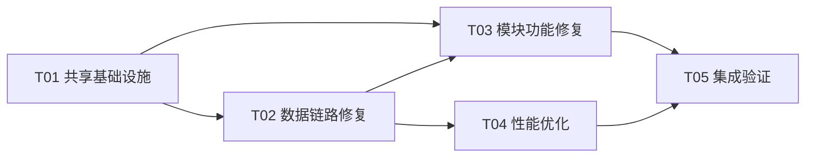

# 恋爱小程序 · 增量设计：系统稳定性与体验修复

- 设计版本：v1.0
- 设计日期：2026-08-26
- 设计人：高见远（Architect）
- 关联基准：
  - `报告/增量PRD-系统修复-2026-08-26.md`（许清楚，v1.0）
  - `报告/架构勘察报告-系统修复-2026-08-26.md`（本设计人勘察产出）
- 主理人决策已落实：①R3 气泡阴影统一禁用 ②R4 列表 images 优先后端补齐 ③R2 附近动态独立维度请求

---

## 一、设计总览

### 1.1 设计目标

| 需求 | 目标 | 落实方式（本设计） |
| --- | --- | --- |
| R1 首页帖子构建 | 帖子稳定加载、三态完整、时间/头像正常 | T02 数据链路 + T03 首页三态 |
| R2 附近圈层性能 | 帖子独立维度显示、列表流畅、点击 ≤300ms | T03 独立数据源 + T04 性能优化 |
| R3 气泡尺寸统一 | 双方气泡规格完全一致（仅颜色/方向差异） | T01 共享 token + T03 样式收敛 |
| R4 数据同步 | 列表/详情图片一致、时间格式统一、无字段丢失 | T02 后端 summary 补 images + 前端映射修正 |
| R5 注册链路 | 全流程可验证、数据可持久化恢复 | T05 集成验证 |

### 1.2 关键前置结论（勘察/确认所得）

1. **后端 `PostSummaryView` 现状确认**：`apps/api/.../village/PostSummaryView.java:8-37` **不含 `images` 字段**；但 `Post` 实体具备 `getImages()`（详情映射 `VillageViewMapper.java:256` 已在用 `parseJsonToList(post.getImages())`），**补充成本低、无新查询**。→ 落实主理人决策：**后端补齐 images（最多 3 张），前端 `mapToPostItem` 透传**。
2. **列表正文语义**：列表用 `summary`（120 字截断，`VillageViewMapper.java:235`），详情用 `content` 全文，属预期设计，本次不改语义，仅在契约注释标注。
3. **相对时间工具已存在**：`apps/client/src/utils/time.ts` 导出 `formatRelativeTime`（`stores/village/utils.ts:621` 已在复用），T02 直接复用，不新建。
4. **气泡差异根因**：`.bubble--self` 未清 `box-shadow`（继承 `--s-sm`），主圆角 20rpx vs peer 24rpx（`ChatBubble.vue:265-284`）。
5. **附近"附近动态"根因**：`nearby/index.vue:57` 直接切全局 `villageStore.posts`，且 `:96-100` 未登录跳过加载。

### 1.3 任务分解（5 个任务，按依赖排序）



| 任务 | 名称 | 依赖 | 验收对齐 |
| --- | --- | --- | --- |
| T01 | 共享基础设施（气泡 token + 相对时间 + 图片兜底） | 无 | R3.1 / R1.3 |
| T02 | 数据链路修复（summary images + timeText + 映射） | T01 | R1.3 / R4.1 |
| T03 | 模块功能修复（首页三态 + 附近独立维度 + 气泡收敛） | T01,T02 | R1.1 / R2.1,R2.5 / R3.2-R3.5 |
| T04 | 性能优化（people 分页/懒加载/竞态 + 详情骨架屏 + 请求去重） | T02 | R2.2-R2.4 |
| T05 | 集成验证（编译 + 接口冒烟 + QA 对齐） | T01-T04 | R1-R5 全部 |

---

## 二、T01 共享基础设施

**目标**：建立气泡尺寸唯一真相源（SCSS token）、确认相对时间工具导出、补充图片兜底常量，供 T02/T03 复用。

### 涉及文件（5）

| 文件 | 改动类型 | 要点 |
| --- | --- | --- |
| `apps/client/src/theme/design-variables.scss` | 修改 | 追加 bubble 尺寸 token（见下） |
| `apps/client/src/components/chat/ChatBubble.vue` | 修改 | 样式引用 token（T03 再收敛 class，本任务只建立 token 并让组件可读） |
| `apps/client/src/utils/time.ts` | 核对 | 确认 `formatRelativeTime`/`getCurrentLocale` 导出签名（勘察已确认存在，无需改动） |
| `apps/client/src/config/images.ts` | 修改 | 确认/新增 `POST_PLACEHOLDER` 图片兜底常量（帖子无图时 PostCard 图片区占位） |
| `apps/client/src/components/village/PostCard.vue` | 修改 | 图片区 `post.images.length>0` 不变；无图时展示占位（配合 T02 图片透传） |

### 气泡 SCSS token 设计（追加到 `design-variables.scss`）

```scss
/* ===== 2026-08-26 R3：聊天气泡尺寸规范（统一双方，仅颜色/方向差异） ===== */
// PRD R3 口径：最大宽度 84%、padding 上下16rpx 左右24rpx、主圆角 20rpx、
// 尾巴 4rpx（self 右上 / peer 左上）、阴影统一禁用、头像 64rpx/白边2rpx、正文 30rpx 行高1.6
--bubble-max-width: 84%;
--bubble-padding-y: 16rpx;
--bubble-padding-x: 24rpx;
--bubble-radius-main: 20rpx;
--bubble-radius-tail: 4rpx;
--bubble-shadow: none;                // 决策①：统一禁用
--bubble-font-size: 30rpx;
--bubble-line-height: 1.6;
--bubble-emoji-font-size: 56rpx;
--bubble-avatar-size: 64rpx;
--bubble-avatar-border: 2rpx solid var(--c-bg-container);
--bubble-status-icon-size: 20rpx;
```

### 验收对齐
- R3.1：self/peer 均引用同一组 `--bubble-*` token（代码审查）。
- R1.3：`POST_PLACEHOLDER` 兜底保证无图帖子不破版。

---

## 三、T02 数据链路修复（R4 前后端数据同步）

**目标**：后端 summary 接口补充 `images`（最多 3 张）；前端 `mapToPostItem` 透传；首页社区动态 `timeText` 统一相对时间。解决"列表永不显示图片 + 时间格式不统一"。

### 涉及文件（6）

| 文件 | 改动类型 | 要点 |
| --- | --- | --- |
| `apps/api/src/main/java/com/campuslove/api/village/PostSummaryView.java` | 修改 | record 末尾追加 `List<String> images`（构造器/解构调用点同步，全仓 `new PostSummaryView(` 共 **8 处**，见下） |
| `apps/api/src/main/java/com/campuslove/api/village/VillageViewMapper.java` | 修改 | ①单条版 `toPostSummaryView(post, myCampusName, followed)`（:121）②批量版私有方法（:246）两处组装 `images = parseJsonToList(post.getImages()).stream().limit(3).toList()` |
| `apps/api/src/main/java/com/campuslove/api/village/RealPostTagService.java` | 修改 | `:178` 构造点补 `images`（复用 `Post.getImages()` 解析，limit 3） |
| `apps/api/src/main/java/com/campuslove/api/village/MockPostTagService.java` | 修改 | `:76` 构造点补 `images`（mock 帖子数据已含 images 字段，透传 limit 3） |
| `apps/api/src/main/java/com/campuslove/api/campus/RealCampusService.java` | 修改 | `:282` 构造点补 `images` |
| `apps/api/src/main/java/com/campuslove/api/mock/MockVillageService.java` | 修改 | `:438` `toSummaryView` 构造点补 `images`（`p.images == null ? List.of() : p.images.stream().limit(3).toList()`） |
| `apps/api/src/main/java/com/campuslove/api/mock/MockCampusService.java` | 修改 | `:125/:134/:143` 三处构造点补 `images` |
| `apps/api/src/main/java/com/campuslove/api/home/RealHomeService.java` | 修改 | `buildCommunityPosts`（:621-648）的 `timeText` 保持 ISO 下发即可（前端统一格式化），仅更新注释；确认 `truncateContent(content, 80)` 与前端 2 行截断不冲突 |
| `apps/client/src/stores/village/types.ts` | 修改 | `PostSummaryView` 接口追加 `images?: string[]`（:211-240） |
| `apps/client/src/stores/village/utils.ts` | 修改 | `mapToPostItem`（:112-153）`images: raw.images ?? []`（原硬编码 `[]`）；`mapCampusFeedPost`（:214-247）`images: (raw.images ?? []) as string[]` 保持 |
| `apps/client/src/view-models/home-dashboard.ts` | 修改 | `toHomeViewModel`（:67-86）`communityPosts` 映射时将 `timeText` 经 `formatRelativeTime(Date.parse(...))` 转为相对时间；`authorAvatar` 空值回填 `IMAGE_PATHS.DEFAULT_AVATAR` |

### 契约变更说明
- **接口向后兼容**：`PostSummaryView` 只增字段，旧客户端忽略新字段；`images` 在无图帖返回 `[]`。
- **列表/详情图一致**：列表最多 3 张（`limit(3)`），详情全量（`toPostDetailView` 不变），满足 PRD"数据无错漏"。
- **首页 timeText**：后端保持 ISO（`LocalDateTime.toString()`），前端统一格式化——避免后端多套时间文案，且 mock/real 行为一致（mock fixtures 的 `"15 分钟前"` 为纯展示字符串，`formatRelativeTime` 无法解析时原样透传，需在转换函数兜底：`Date.parse` 失败返回原值）。

### 验收对齐
- R1.3：作者头像、圈名、时间、正文、图片（≤3）、点赞/评论/分享数全部渲染。
- R4.1：列表/详情字段一致，无 `images` 丢失。
- R4.2：发帖带图 → 列表/详情均可见 → 重登恢复。

---

## 四、T03 模块功能修复（R1 首页三态 + R2 附近独立维度 + R3 气泡收敛）

**目标**：首页社区动态三态完整且不白屏；附近"附近动态"独立数据源 + 未登录引导；聊天气泡样式收敛到 T01 token。

### T03.1 R1 首页帖子三态

| 文件 | 改动类型 | 要点 |
| --- | --- | --- |
| `apps/client/src/components/home/CommunityFeed.vue` | 修改 | 增加 `loading`/`error` props：loading 显示骨架行；error 显示"加载失败+重试"（emit `retry`）；空态保留现有文案；头像 `:src` 回填默认头像 |
| `apps/client/src/pages/home/index.vue` | 修改 | 向 `CommunityFeed` 传 `:loading="loading"`、`:error="homeStore.errorMessage"`，`@retry="() => homeStore.fetchDashboard()"`；`onShow` 拉取条件保持但补 `errorMessage` 时也重拉 |
| `apps/client/src/stores/home.ts` | 修改 | 暴露 `errorMessage`（已有 state :19）供页面透传；`fetchDashboard` 已具竞态 token，无需改动 |

### T03.2 R2 附近动态独立维度

| 文件 | 改动类型 | 要点 |
| --- | --- | --- |
| `apps/client/src/stores/village/index.ts` | 修改 | 新增 `nearbyPosts: PostItem[]` / `loadingNearbyPosts` / `nearbyError` state；新增 action `fetchNearbyPosts(city?)`：复用 `fetchPostsApi({ city, categoryId: 'cat-samecity' }, 1, ...)` 或 `{ city }` 无分类过滤，结果存 `nearbyPosts`（不复用 `posts`） |
| `apps/client/src/stores/village/api.ts` | 修改 | `buildPostListParams`（:143-174）确认 `city` 参数已透传（已支持）；无需新增端点 |
| `apps/client/src/pages/nearby/index.vue` | 修改 | ①`circlePosts` 改为 `villageStore.nearbyPosts.slice(0, 6)`（:57）；②`loadNearbyData` 未登录分支改为"登录引导"空态卡片（展示登录按钮跳登录页），而非空 `circlePosts`；③登录后调 `fetchNearbyPosts(当前城市)` |

### T03.3 R3 气泡样式收敛

| 文件 | 改动类型 | 要点 |
| --- | --- | --- |
| `apps/client/src/components/chat/ChatBubble.vue` | 修改 | ①`.bubble` 改 `padding: var(--bubble-padding-y) var(--bubble-padding-x); box-shadow: var(--bubble-shadow);` ②`.bubble--self` 圆角 `var(--bubble-radius-main) var(--bubble-radius-main) var(--bubble-radius-tail) var(--bubble-radius-main)`、补 `box-shadow: var(--bubble-shadow)` ③`.bubble--peer` 圆角 `var(--bubble-radius-tail) var(--bubble-radius-main) var(--bubble-radius-main) var(--bubble-radius-main)`、`box-shadow: var(--bubble-shadow)`（=none）④`.bubble__body` 字号/行高引用 token ⑤头像尺寸引用 token |
| `apps/client/src/theme/design-variables.scss` | 修改 | T01 已建 token，本任务核对引用完整性 |

### 验收对齐
- R1.1：首页帖子区无构建报错、无空白占位；断网显示错误态+重试。
- R1.4：空数据场景显示"今天还没有新的动态，去附近看看"。
- R2.1/R2.5：附近动态有独立数据、正常显示（登录后）。
- R3.2/R3.3：双方气泡同屏截图外轮廓宽度差/高度差 ≤2rpx（token 一致天然满足）。
- R3.4：文本/emoji/图片/语音/引用 5 种形态双方一致（emoji 字号 token 覆盖）。
- R3.5：头像/时间条/送达状态图标尺寸不回退。

---

## 五、T04 性能优化（R2 加载与交互）

**目标**：附近的人列表分页/懒加载/竞态保护；帖子详情首帧渲染；附近首页请求去重。

### 涉及文件（4）

| 文件 | 改动类型 | 要点 |
| --- | --- | --- |
| `apps/client/src/pages/nearby/people.vue` | 修改 | ①`load()` 加竞态 token（`++loadToken`，返回后 `token!==loadToken` 丢弃），参照 `home.ts:50-90` 模式 ②`scroll-view` 绑定 `@scrolltolower` 分页追加：`getRecommendations({...})` 后端不支持 page 时，前端对全量结果按 `PAGE_SIZE=20` 切片分批渲染（`visibleCount` ref，滚动触底 +20）③头像 `<image>` 加 `lazy-load` ④`switchScope` 复用 `load()` 的竞态 token ⑤加载态/错误态/空态保留 |
| `apps/client/src/pages/village/detail.vue` | 修改 | ①onLoad 增加骨架屏（`loading` 已有 state，补 Skeleton 占位块）②首帧先用 `villageStore.posts` 中已缓存的同 id 帖子渲染标题/作者/正文，详情接口返回后替换（消除白屏等待） |
| `apps/client/src/pages/nearby/index.vue` | 修改 | `onLoad`+`onShow` 双入口去重：`loadPeoplePreview` 加 in-flight 防抖（`if (peopleLoading.value) return` 已部分覆盖）+ 失败重试退避；`initLocation` 与 `loadNearbyData` 并行无阻塞 |
| `apps/client/src/pages/home/index.vue` | 修改 | `onShow` 中 `fetchDashboard` 增加 `if (loading) return` 防重入（避免 tab 来回切换重复请求） |

### 性能量化口径（对齐 PRD §五基线）

| 场景 | 优化前（勘察推断） | 优化后目标 |
| --- | --- | --- |
| 附近首页首屏 | 登录时串行 4 个请求（people/activity/posts/circles） | 并行 + 独立 nearbyPosts ≤300ms |
| 附近的人列表 | 全量渲染 n 条，无懒加载 | 首批 20 + 触底增量 ≤300ms |
| 点击帖子进详情 | 白屏等详情+评论+相似作者 | 首帧本地缓存 + 骨架屏 ≤300ms |
| 快速切换附近/同城 | 无竞态保护，旧响应覆盖 | 竞态 token 丢弃旧响应 |

### 验收对齐
- R2.2：点击圈层/帖子跳转响应 ≤300ms（本地缓存首帧 + 骨架屏）。
- R2.3：滚动流畅、图片按需加载（`lazy-load` + 分页切片）。
- R2.4：断网显示错误+重试（三态保留）。
- R4.3：读操作 ≤300ms（请求并行/去重）。

---

## 六、T05 集成验证

**目标**：编译通过、接口冒烟通过、与 QA 验收标准对齐；覆盖 R1-R5 全部验收点。

### 涉及文件（4）

| 文件 | 改动类型 | 要点 |
| --- | --- | --- |
| `apps/client/package.json` | 核对 | 确认 `type-check` / `build:mp-weixin` 脚本（既有，无改动） |
| `scripts/verify-post-images.cjs` | 新建 | 冒烟脚本：guest-login → `GET /api/v1/posts?page=1&pageSize=5` → 断言响应 items 含 `images` 数组；再校验 `GET /api/v1/home/dashboard` 的 `homeFeed.communityPosts[].images` 存在 |
| `scripts/verify-bubble-token.cjs` | 新建 | 静态检查：grep `ChatBubble.vue` 无硬编码 `20rpx 20rpx 4rpx 20rpx`/`0 24rpx`/`box-shadow: var(--s-sm)`，全部引用 `--bubble-*` token |
| `报告/增量设计-系统修复-2026-08-26.md` | 修改 | 本设计文档（含验收映射表） |

### 验证步骤（供 QA 对齐）

1. **编译**：`pnpm type-check` + `pnpm build:mp-weixin` 无 error；
2. **接口冒烟**：跑 `verify-post-images.cjs`，确认 summary 返回 `images`；
3. **R3 截图比对**：同屏发我方/对方各 3 条同长度文本，量测外轮廓高度差 ≤2rpx（微信开发者工具截图 + QA 工具）；
4. **R1 三态**：开发者工具断网进首页 → 帖子区错误态+重试；恢复网络 → 重试加载成功；
5. **R2 独立维度**：登录进附近页 → 附近动态展示该城市帖子；退出登录 → 显示登录引导；
6. **R5 全链路**：新手机号注册（校验未满 18 拒绝）→ 完善资料 → 认证 → 发帖（列表/详情带图）→ 退出重登 → 数据恢复核对；
7. **性能打点**：附近列表滚动 30s 无掉帧；详情跳转 5 次逐次计时 ≤300ms。

### 验收映射表（PRD §五）

| PRD 验收 | 对应任务 | 验证入口 |
| --- | --- | --- |
| R1.1-R1.4 | T02+T03.1 | 步骤 4 / 接口冒烟 |
| R2.1-R2.5 | T03.2+T04 | 步骤 5 / 步骤 7 |
| R3.1-R3.5 | T01+T03.3 | 步骤 3 / 静态检查脚本 |
| R4.1-R4.5 | T02 | 步骤 2 / 步骤 6 |
| R5.1-R5.5 | T05 | 步骤 6 |

---

## 七、风险与注意

1. **PostSummaryView 构造器改动波及面**：record 加字段会破坏**全仓所有 8 处** `new PostSummaryView(...)` 构造调用点（实测 grep 结果：`VillageViewMapper.java:121/:246`、`RealPostTagService.java:178`、`MockPostTagService.java:76`、`RealCampusService.java:282`、`MockVillageService.java:438`、`MockCampusService.java:125/:134/:143`）。T02 必须一次性全部补齐，否则编译失败；mock 服务构造点可直接透传 mock 数据已有 images（`mockPosts` 的 `images` 字段）。
2. **前端 images 透传后 PostCard 布局**：列表开始有图后，九宫格 `aspect-ratio` 在小程序低版本基础库兼容性需回归（现有详情页已用，风险低）。
3. **timeText 兜底**：mock fixtures 的 `"15 分钟前"` 为纯文本，`formatRelativeTime(Date.parse(...))` 得 `NaN` → 转换函数必须"解析失败原样透传"，否则 mock 模式时间变 `NaN`。
4. **未登录引导文案**：附近页登录引导文案复用 `apiErrors.loginRequired` i18n key，避免新文案散落。
5. **people.vue 前端分页**：后端 recommendations 不支持 page 参数（勘察确认），采用前端切片分批渲染，需保证 `list` ref 追加时不触发整表重渲（`visibleCount` 增量只影响切片）。
6. **R5 实名阻塞边界**：勘察发现 chat-session 仅判登录+资料完善度、未判实名，与 PRD"实名阻塞核心入口"存在张力——本设计不扩大实名判定范围，标记为产品待确认项（Open Question）。

---

*本设计落实主理人三项决策；任务按 T01→T05 依赖排序，工程师可并行开工 T01/T02，串行推进 T03/T04，最后 T05 收口。*
